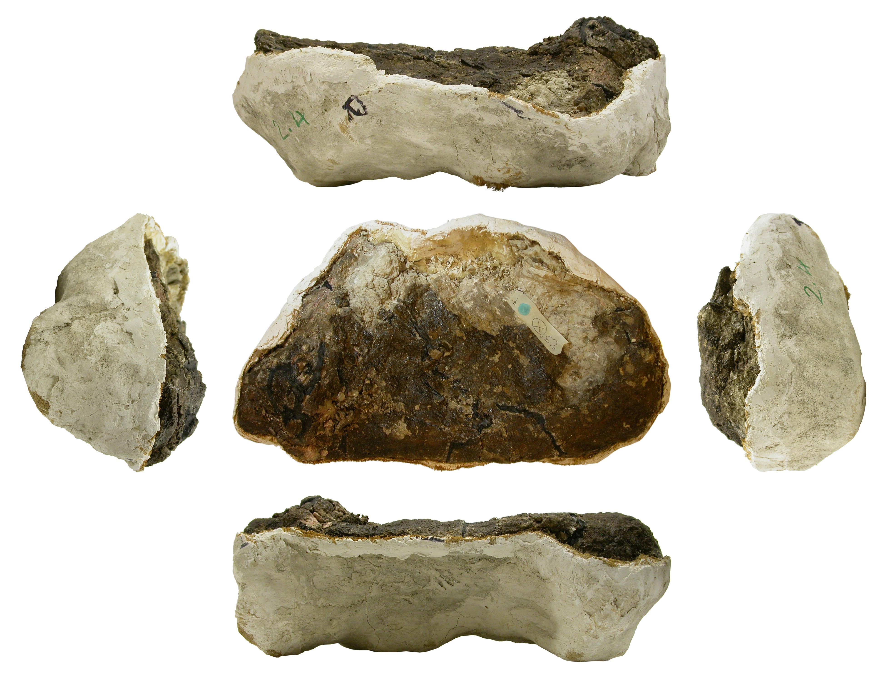

# "The Archbishop", a brachiosaurid sauropod from the Tendaguru Formation (Latest Jurassic) of Tanzania, Africa.

Mike Taylor.
Department of Earth Sciences,
University of Bristol,
Bristol BS8 1RJ,
UK.
<dino@miketaylor.org.uk>

## Contents

<!-- md2toc -l 2 -s 1 archbishop-manuscript.md -->
* [Abstract](#abstract)
* [Introduction](#introduction)
    * [Institutional abbreviations](#institutional-abbreviations)
    * [Anatomical nomenclature](#anatomical-nomenclature)
* [Historical background](#historical-background)
    * [The German East Africa Expeditions](#the-german-east-africa-expeditions)
    * [The British Museum East Africa Expedition](#the-british-museum-east-africa-expedition)
* [Contemporary accounts](#contemporary-accounts)
* [Brachiosaurid sauropods](#brachiosaurid-sauropods)
* [Description](#description)
    * [Catalogue of material](#catalogue-of-material)
    * [Cervical vertebrae](#cervical-vertebrae)
        * [Cervical W](#cervical-w)
        * [Cervical V](#cervical-v)
        * [Cervical U](#cervical-u)
        * [Cervical P](#cervical-p)
        * [Cervical S](#cervical-s)
        * [Cervical T](#cervical-t)
    * [Cervical ribs](#cervical-ribs)
        * [Cervical rib X1](#cervical-rib-x1)
        * [Cervical rib X2](#cervical-rib-x2)
        * [Cervical rib X3](#cervical-rib-x3)
    * [Dorsal vertebrae](#dorsal-vertebrae)
        * [Dorsal vertebrae A and B](#dorsal-vertebrae-a-and-b)
        * [Dorsal vertebral neural spine C](#dorsal-vertebral-neural-spine-c)
        * [Dorsal vertebral centra Q and R](#dorsal-vertebral-centra-q-and-r)
    * ["Lump Z"](#lump-z)
    * ["Scapula"](#scapula)
    * [Long-bone fragment L](#long-bone-fragment-l)
    * [Pubis M](#pubis-m)
* [Comparisons](#comparisons)
    * [Are Janensch's two specimens the same taxon?](#are-janenschs-two-specimens-the-same-taxon)
* [Phylogenetic analysis](#phylogenetic-analysis)
* [Systematic Palaeontology](#systematic-palaeontology)
* [Discussion](#discussion)
* [Acknowledgements](#acknowledgements)
* [References](#references)

## Abstract

XXX To follow

## Introduction

The German East Africa expeditions of the Humboldt Museum für Naturkunde in the period before the First World War were among the most ambitious ever undertaken (Maier 2003), and yielded many superb dinosaur skeletons including the type specimens of new sauropod, theropod and ornithischian dinosaurs. After the war, the subsequent expeditions of the British Museum (Natural History) were much humbler affairs, and their results were correspondingly unimpressive. The best specimen -- a large and fairly complete sauropod skeleton -- was excavated and returned to London, but was then largely ignored for the next 75 years. In this paper, I describe this overlooked specimen, assess its affinities, and discuss its implications for sauropod systematics and palaeoecology.

### Institutional abbreviations

* BMNH -- See NHMUK.
* FMNH -- Field Museum of Natural History, Chicago, Illinois, USA.
* HMN -- See MB.
* MB -- Museum für Naturkunde Berlin, Berlin Germany. Formerly HMN, Humboldt Museum für Naturkunde.
* NHMUK -- National History Museum, London, UK. Formerly BMNH, British Museum (Natural History.

### Anatomical nomenclature

XXX To follow

## Historical background

### The German East Africa Expeditions

Between the years of 1907 and 1913, the Humboldt Museum für Naturkunde in Berlin, Germany, sent a series of palaeontological expeditions to Tendaguru in what was then German East Africa (Maier2003).  These expeditions, led by Werner Janensch, excavated more than 185 tonnes of fossils, mostly dinosaurs.  When prepared, these fossils proved to include spectacularly complete specimens representing several dinosaurian clades: the ceratosaurian theropod _Elaphrosaurus bambergi_ Janensch, 1920, the ornithopod _Dysalotosaurus lettowvorbecki_ Virchow, 1919, the spiked stegosaur _Kentrosaurus aethiopicus_ Hennig, 1915, and several different sauropods: two species of _Dicraeosaurus_ (_D_. _hansemanni_ and _D_. _sattleri_ Janensch 1914), representing the then new family Dicraeosauridae; “_Gigantosaurus_” _africanus_ Fraas, 1908, whose complex affinities are outlined below; and the giant brachiosaurid “_Brachiosaurus_” _brancai_ Janensch, 1914, the mounted skeleton of which is the centerpiece of the exhibition of the Museum für Naturkunde Berlin. (Further species have been named from the Tendaguru formation, but these are based on fragmentary remains.)

The nomenclatural history of the well-represented species has in some cases been complex. Because of its effect on the apparent diversity of dinosaurs in the Tendaguru Formation, this history warrants some explanation.

_Dysalotosaurus_ was synonymised with _Dryosaurus_ Marsh, 1894, by Galton (1977), yielding the combination _Dryosaurus lettowvorbecki_. This has been followed by most authors, although it was recently disputed by Witzmann et al (2008) and awaits further exploration.

The year after _Kentrosaurus_ was named, its author, noting that the name was similar to and shared its etymology with the ceratopsian dinosaur _Centrosaurus_ Lambe, 1904, proposed the replacement name _Kentrurosaurus_ Hennig, 1916; and Nopcsa (1916) independently proposed the replacement name _Doryphorosaurus_ for the same reason. However, since _Centrosaurus_ is pronounced with a soft “C” and _Kentrosaurus_ with a hard “K”, the two are not homonyms, and the original name remains valid, with _Kentrurosaurus_ and _Doryphorosaurus_ being junior objective synonyms.

As recounted in detail by Taylor (2009), Janensch's referral of the species “_Brachiosaurus_” _brancai_ to the North American genus _Brachiosaurus_ Riggs, 1903 was made without having seen material of type species _Brachiosaurus altithorax_ Riggs, 1903, and was based primarily on features which we can now recognise as symplesiomorphies. The referral was questioned by Lull (1911), but generally accepted until Paul (1988) noticed proportional differences between the species while executing a skeletal reconstruction, and accordingly proposed subgeneric separation, with the African species becoming _Brachiosaurus_ (_Giraffatitan_) _brancai_. Olshevsky (1991) proposed that the subgenus _Giraffatitan_ be raised to generic rank, but the name was not used in the literature, “_Brachiosaurus_” _brancai_ being retained, until Taylor (2009) demonstrated, based on 26 features that differ from _Brachiosaurus altithorax_, that _Giraffatitan brancai_ is indeed generically distinct, and this usage is now generally followed.

The name “_Gigantosaurus_” has the most complex history of all. Fraas chose this name in full knowledge that it had already been used for the poorly represented English genus _Gigantosaurus_ Seeley, 1869, but wrongly believing that the name was available as Seeley had not described or figured the material that his own genus was founded on. He named the type species _G_. _africanus_ and referred a second species, _G_. _robustus_. Recognising Fraas's error in using a preoccupied name, Sternfeld (1911) renamed the German genus _Tornieria_, the two species becoming _T_. _africana_ and _T_. _robusta_. Janensch (1922), however, continued to use the older name “_Gigantosaurus_”, but observed in a footnote that differences such as possession of bifid neural spines in “_G_”. _africanus_ and single spines in “_G_”. _robustus_ required generic separation. Believing the type species “_G_”. _africanus_ to belong to the North American genus _Barosaurus_ Marsh, 1890, Janensch referred to the two species as _Barosaurus africanus_ and _Gigantosaurus robustus_. The latter name would have been invalid even if the genus _Gigantosaurus_ had not been preoccipied, since its type species had been removed making _Gigantosarus_ a junior subjective synonym of _Barosaurus_; however, Janensch did not refer the remaining species _robustus_ to a new genus as he should have done. This was eventually done by Wild (1991), who placed the species in the new genus _Janenschia_ as _J_. _robusta_, and assigned it to Titanosauria. Bonaparte et al (2000), however, noted that the axial material assigned to _Janenschia_ was not convincingly associated with the appendicular type material, and removed this material to another new genus, _Tendaguria_. They considered _Janenschia_ to be a camarasaurid and _Tendaguria_ to belong to its own monogeneric family due to the very unusual morphology of the dorsal vertebra on which is was based. Janensch's referral of the _Tornieria africana_ material to _Barosaurus_ was mostly followed, but McIntosh (2005) questioned this, considering it more similar to _Diplodocus_ and not convincingly congeneric with either. Remes (2006) restudied this material and concluded that it represents a distinct genus for which he resurrecting the available name _Tornieria_, which now contains only the single species _T_. _africana_. Finally, Remes (2007) noted that two cervical vertebrae that had been referred to this species were distinct, and referred them to the new genus _Australodocus_. In conclusion, the two species of “_Gigantosaurus_” are now considered to belong to four distinct monospecific genera: _Tornieria_, _Janenschia_, _Tendaguria_ and _Australodocus_.

### The British Museum East Africa Expedition

German operations in East Africa were interrupted by the Great War (1914-1918), during which the territory of German East Africa changed hands and became the British protectorate of Tanganyika. Aware of the impressive results of the German expeditions, the British Museum (Natural History) began in 1920 to plan expeditions of their own, hoping to obtain display-quality specimens comparable to those that were starting to emerge from Berlin. After a series of delays, the expeditions finally commenced in 1924, under the leadership of William Cutler assisted by Louis Leakey. Cutler died in the field in 1925, having obtained only fragmentary material, and was replaced by Frederick W. H. Migeod in late 1925 and through 1926. However, Migeod's work was impeded by his lack of palaeontological experience, as he was an explorer rather than a scientist. For this reason he was himself replaced by John Parkinson for the 1927 and 1928 field seasons. For reasons that are unclear, Parkinson's contract was not renewed in 1929, and Migeod returned, to be joined in 1930 by a new assistant, Francis R. “Rex” Parrington. By this stage, the BMNH had been excavating in Tendaguru for six years with little to show for it: there were plenty of isolated bones, but no skeleton complete enough to compare with the spectacular German material.

The 1930 field season, however, excavated quarry M23, and so yielded the specimen that the BMNH had been awaiting. Although Migeod was 58 by this time, he supervised the excavation of a large, fairly complete and partially articulated sauropod skeleton, since catalogued as BMNH R5937, now NHMUK R5937. Although this material seemed to meet the BMNH's requirement for a display-quality specimen, it remained largely unprepared and was described only in an informal account of the 1930 field season (Migeod 1931a), a paper written without having seen any of the material prepared, and which is figured only with field photographs and a quarry map. Several subsequent popular accounts (Migeod 1931b, Migeod 1931c Parrington 1931) added little information.

XXX ### “Funds are lacking” at end of Discovery article.

Despite its completeness and the good preservation of some of the material, Migeod's specimen has been consistently neglected in the intervening decades: much of what was collected has been lost, some of what remains has yet to be prepared, and the prepared material has never been properly studied. When in the early 1960, John S. McIntosh expressed an interest in studying the material, he was discouraged a letter sent by W. E. Swinton which read (in part): “I feel rather sad at your quest for I knew Migeod very well and had much sympathy with him but alas, I knew the material he collected even better [...] The few good bones he collected would not constitute a single limb and but a few feet of backbone. Indeed, much of East Africa was enclosed in plaster with the mistaken impression that bone was contained within. You will not, therefore, see any monographs on the specimen and you can dismiss his particular dinosaur from your mind” (unpublished letter). Swinton's dismissal is puzzling, contradicting Migeod's own account of the material and, as will become clear, greatly underestimating its value.

What few references there have been to NHMUK R5937 in the literature have often used incorrect specimen numbers and mischaracterised the material – for example, Paul (1988) and Glut (1997) refer to specimen “BMNH M 23”, using the quarry number as a specimen number. 

## Contemporary accounts

XXX Migeod papers: material found, quarry map, interpretations

XXX Parrington papers

XXX Migeod speaks of the dorsal vertebrae having "wings". FMNH P25107's presacral P7 shows an "apron" similar to that of SII.D?7 -- a wide, contiguous set of horizontal laminae joining prezygs to diapophyses and postzygs.  This morphology is unusual, and may be what Migeod refers to as "wings".

XXX Lots of good stuff at
https://www.britishnewspaperarchive.co.uk/search/results?basicsearch=tendaguru%20dinosaur&exactsearch=false&retrievecountrycounts=false&newspapertitle=illustrated%20london%20news

XXX Comments about Migeod (Huene etc.)

Migeod's numbering of the vertebrae of this specimen was rather eccentric. Rather than number the cervicals starting at C1 for the atlas and increasing backwards, he designated a single "shoulder vertebra", and counted both cervical vertebra forward from this zero-point, and dorsal vertebrae backwards. The sequence of vertebrae from posterior neck backwards, then, using Migeod's numbering, was ... C3, C2, C1, 0, D1, D2, D3.

The identity of the "shoulder vertebra" can be established, though with some uncertainty, by the dimensions of XXXX its length and those of the vertebrae either side. Migeod (1931a:91) says "The first cervical (C1) is 33 inches long, compared with about two feet in _Diplodocus_". Hatcher (1901:38) gives the lengths of vertebral centra of the _Diplodocus carnegii_ holotype CM 84 as follows:
C14 (642 mm = 25.3 inches),
C15 (595 mm = 23.4 inches),
D1 (510 mm = 20.1 inches) and
D2 (416 mm = 16.4 inches).
On this basis alone, we can conclude that by the "shoulder vertebra", of "about two feet" in length, Migeod most likely meant what we would designate C15 (or, less probably, C14).

XXX Diplodocus C15 595x542, D1 510x614, D2 416x691

## Brachiosaurid sauropods

XXX To follow

## Description

### Catalogue of material

Many of the elements that were prepared long age have either Migeod's quarry number M23 painted directly on them, or the specimen number R 5937 written on a small, round yellow label firmly fixed to the bone, so their inclusion in the hypodigm is easy to establish.

Since the serial positions of vertebrae are not possible to determine with confidence, the various elements have been assigned letters. The letters were assigned piecemeal some time ago, and are no particular order. They convey no implication of serial position. Available material of the Archbishop includes:

Name | Element | Description
:--- | :------ | :----------
W | ?cervical vertebra | Unprepossessing lump of bone, difficult to interpret
V | cervical vertebra | Small, anterior cervical vertebra, still half-jacketed. Poorly presered and very fragile. 
U | cervical vertebra | Large, well preserved cervical vertebra, half-jacketed with the right side and anterior/posterior extremities exposed.
P | cervical vertebra | Large cervical vertebra, well preserved in places, but obscured by poorly executed restoration.
S | cervical centrum | Large cervical vertebral centrum, almost all of the neural arch and ann processes missing.
T | cervical centrum | Large cervical vertebral centrum, almost all of the neural arch and ann processes missing.
X1 | cervical rib | Proximal portion of left cervical rib, reasonably well preserved.
X2 | cervical rib | Proximal portion of right cervical rib, poorly preserved.
X3 | cervical rib | Proximal portion of right cervical rib, poorly preserved.
X | cervical rib framents | Portions of cervical rib shafts, impossible to associate convincingly with X1-X3.
A/B | dorsal vertebrae | Conjoined consecutive pair of well-preserved essentially complete dorsal vertebrae.
C | dorsal neural spine | Isolated neural arch and spine from a dorsal vertebra.
Q/R | dorsal centra | Conjoined consecutive pair of dorsal vertebral centra.
Z | semi-prepared jacket | Difficult-to-interpret set of bones, almost certainly vertebral processes.
N | ?scapula | Two pieces of uninformative flat bone.
O | ?coracoid | Flat, subcircular piece of bone.
M | ?pubis | Portion of a bone with a complex shape.
L | long-bone fragment | Portion from the shaft of a limb bone, both ends missing.

In addition, there are a dozen or so as-yet unopened jackets from the Migeod expedition. However, these do not look promising in their ability to deliver further informative material. They are too small to contain complete vertebrae or even substantial partial vertebral material, and since there is no reason to expect that they contain cranial material, it is likely that the contents are mostly limb- and girld-bone fragments and indeterminate scraps. However, the chance remains that some diagnostic material is contained, and the jackets should be prepped as circumstances allow.

### Cervical vertebrae

XXX To follow

#### Cervical W

> **Figure W.** NHMUK PV R5937, "The Archbishop", cervical vertebra W. On the assumption that the middle part of this illustration is right lateral, the parts are as follows. Top row: dorsal view (anterior to left); middle row (left to right): posterior, right lateral and anterior views; bottom row: ventral view (anterior to right).

XXX Jacket said "C3".

XXX To follow

#### Cervical V

> **Figure V.** NHMUK PV R5937, "The Archbishop", cervical vertebra V. Top row: dorsal view; middle row (left to right): posterior, right lateral, and anterior views; bottom row: ventral view.

XXX To follow

#### Cervical U

> **Figure U.** NHMUK PV R5937, "The Archbishop", cervical vertebra U. Top row: dorsal view; middle row (left to right): posterior, right lateral, and anterior views; bottom row: ventral view.

XXX Cervical U is approximately 81cm long. But OLD/new-visit measures it as 79cm.

XXX To follow

#### Cervical P

> **Figure P.** NHMUK PV R5937, "The Archbishop", cervical vertebra P. Top row: left lateral view; second row: dorsal view (anterior to right); bottom row (left to right): posterior, right lateral, and anterior views.

"No 5" is painted on the left dorsolateral aspect of the posterior end of this vertebra in white paint.  This may represent Migeod's observation of the position it was found in, indicating that it is the fifth most proximal cervical (i.e. C9 if the neck has thirteen vertebrae like _Giraffatitan_), but may only be a field number.

XXX Its length from condyle to cotyle is about 90cm, but it's hard to measure accurately while it's behind the dorsals. The cotyle height is estimated at 22 cm. OLD/new-visit also measures it as 90cm.

XXX To follow

#### Cervical S

> **Figure S.** NHMUK PV R5937, "The Archbishop", cervical vertebra S. Top row: left lateral view; second row: dorsal view (anterior to right); bottom row (left to right): posterior, right lateral, and anterior views.

XXX Measurements for Cervical S: 72cm right lateral length (cotyle margin to condyle).  Local maxima in vertical height 31cm (parapophysis to dorsal eminence which may be supraprezygopophyseal lamina) and 35cm from PCPL to the highest preserved part of the spine, which is broken near the top.  18cm across cotyle (vertical). 18cm across cotyle (horizontal) also. But OLD/new-visit measures it as 72cm.

> **Figure S2.** NHMUK PV R5937, "The Archbishop", cervical vertebra S in right posterolateral view, red-cyan anaglyph.

> **Figure S3.** NHMUK PV R5937, "The Archbishop", cervical vertebra S in posterior view, close-up of postzygapophyses, ?hyposphene and neural canal, red-cyan anaglyph.

XXX To follow

#### Cervical T

> **Figure T.** NHMUK PV R5937, "The Archbishop", cervical vertebra T. Top row: left lateral view; second row: dorsal view (anterior to right); bottom row (left to right): posterior, right lateral, and anterior views.

XXX Cervical T is about 80cm long, but too awkwardly located to measure more fully. It is in poor condition. But OLD/new-visit measures it as 85cm.

> **Figure T2.** NHMUK PV R5937, "The Archbishop", cervical vertebra T in anterior view, red-cyan anaglyph.

XXX To follow

### Cervical ribs

> **Figure X.** NHMUK PV R5937, "The Archbishop", cervical ribs and fragments. In the middle of the bottom part of the illustration is left cervical rib X1 (see below), here seen in dorsomedial view with anterior to the bottom right; at the top right, just below the horizontal rib shaft, is right cervical rib X2 (see below), here seen in dorsomedial view with anterior to the left; at the bottom left, to the left of X1, is right cervical rib X3 (see below), here seen in dorsomedial view with anterior to the left. Elsewhere in the box are fragments of rib shaft, some of which may belong to X1, X2 or X3.

XXX These are described as ossified tendons and were long. Rescore the character for CR length.

XXX To follow

#### Cervical rib X1

> **Figure X1.** NHMUK PV R5937, "The Archbishop", left cervical rib X1. Top row: anterior view (dorsal to left, medial to bottom); middle row (left to right, all with anterior to top): lateral, dorsal, medial, ventral; bottom row: posterior (dorsal to left, medial to top).

XXX To follow

#### Cervical rib X2

> **Figure X2.** NHMUK PV R5937, "The Archbishop", right cervical rib X2. Top row: anterior view (dorsal to right, medial to bottom); middle row (left to right, all with anterior to top): ventral, medial, dorsal, lateral; bottom row: posterior (dorsal to right, medial to top).

XXX To follow

#### Cervical rib X3

> **Figure X3.** NHMUK PV R5937, "The Archbishop", right cervical rib X3. Top row: anterior view (dorsal to right, medial to bottom); middle row (left to right, all with anterior to top): ventral, medial, dorsal, lateral; bottom row: posterior (dorsal to right, medial to top).

XXX To follow

### Dorsal vertebrae

XXX To follow

#### Dorsal vertebrae A and B

> **Figure AB.** NHMUK PV R5937, "The Archbishop", dorsal vertebra A (anterior) and B (posterior). Top row: dorsal view (anterior to right); bottom row (left to right): left lateral, posterior, right lateral, anterior.

> **Figure AB2.** NHMUK PV R5937, "The Archbishop", dorsal vertebra A and B, right posterolateral view, red-cyan anaglyph.

XXX To follow

XXX Try to figure out scoring for C167: Middle-posterior dorsal neural spines, prespinal and postspinal laminae: form mediolaterally wide surfaces, with little anterior relief, ‘infilling’ the prespinal and postspinal fossae (0); form distinct mediolaterally narrow ridges or laminae along the midline of the prespinal and postspinal fossae (1) (Mannion et al., 2013).

XXX Compare the Archbishop with the Potter Creek vertebra described in Jensen 1987, p. 606.

XXX The Archbishop dorsals used to be on display: include photo of the display label about the "huge amphibious reptile".

#### Dorsal vertebral neural spine C

> **Figure C.** NHMUK PV R5937, "The Archbishop", dorsal neural spine C. Top row: dorsal view (anterior to top); middle row (left to right): anterior, left lateral, posterior, right lateral; bottom row: ventral (anterior to bottom).

XXX To follow

XXX When I have recovered measurements of this both this and A+B, I will be able to score character C158: Dorsal neural spines, height: anterior dorsal neural spines subequal to or dorsoventrally shorter than posterior dorsal neural spines (0); anterior dorsal neural spines dorsoventrally taller than posterior dorsal neural spines (1) (Wilson, 2002; Taylor, 2009; Mannion et al., 2013).

#### Dorsal vertebral centra Q and R

> **Figure QR.** NHMUK PV R5937, "The Archbishop", dorsal vertebral centra Q (anterior) and R (posterior). Top row: left lateral; middle row: dorsal view (anterior to right); bottom row (left to right): posterior, right lateral, anterior.

Measurements (all in cm) | Q   | R
:----------------------- | :-- | :--
Length (front of condyle to cotyle) | 32 | 35 est.
Length (back of condyle to cotyle) | 26 | 29
Width of cotyle | -- | 23
Height of cotyle | -- | 25 est.: top lip of cotyle is missing
Total preserved height (top of arch to bottom of cotyle) | -- | 35

XXX The portion of the centrum ventral to the lateral foramina is very rounded laterally and thick, whereas that of _B. brancai_ is more V-shaped and thin (see the cross-section in Janensch ?1950). This morphology is also evident, though less obvious, in Dorsals A and B.

XXX To follow. These are quite heavily damaged and restored.

### "Lump Z"

> **Figure Z.** NHMUK PV R5937, "The Archbishop", "Lump Z" containing unprepared bones, possibly dorsal neural spines in posterior view. Orientation assigned on the assumption of these spines being the correct interpretation. Top row: dorsal view (anterior to top); middle row (left to right): left lateral, posterior, right lateral; bottom row: ventral (anterior to bottom).

> **Figure Z2.** NHMUK PV R5937, "The Archbishop", "Lump Z" containing unprepared bones, possibly dorsal neural spines in posterior view, red-cyan anaglyph. Posterior to right.

XXX To follow

### "Scapula"

[No illustrations yet.]

XXX To follow

### Long-bone fragment L

> **Figure L.** NHMUK PV R5937, "The Archbishop", long-bone fragment L, probably a portion from the distal end of a right humerus. Top row: proximal view (anterior to top); Middle row, left to right: anterior, medial, posterior and lateral views; Bottom row: distal view (posterior to top)

Measurements: 46 cm along the longer side, 35cm along the shorter side, 30cm wide and 12cm thick at the larger end (the 12cm being at the narrow midpoint), 24x16cm at narrow end (the 24cm being exaggerated by the diagonal breakage. I estimate 22cm orthogonally.) There is no sign of a marrow cavity.

This fragment is all that remains of the long bones, and is not particularly informative. Its likely identification as a part of the distal end of the right humerus is based on the presence of the anconial fossa at the broader end, interpreted as distal. This also gives us the orientation of the bone, with face showing this fossa being posterior. The irregular shape of the distal cross section suggests that this is a right humerus because in _Giraffatitan_ the medial aspect is more rounded and the lateral more irregularly shaped: compare with Janensch (1961: Beilage A: figure 1e).

XXX To follow

### Pubis M

> **Figure M.** NHMUK PV R5937, "The Archbishop", ?pubis M. Top row: dorsal (anterior to left); Middle row, left to right: left lateral, posterior.

XXX To follow

## Comparisons

XXX To follow

### Are Janensch's two specimens the same taxon?

> Cervical vertebrae referred by Janensch (1950) to _Giraffatitan brancai_ ("_Brachiosaurus_" _brancai_ of his usage). Left block: lectoype MB.R.2180 ("SI"); right block: paralectotype MB.R.2181 ("SII"). Within each block: left column: posterior view, middle column: lateral, right column: anterior. Rows, from top to bottom: C2, C3, C4, C5, C6, C7, C8. All illustrations taken from Janensch (1950:figures 14-46). Cervicals 6, 7 and 8 of MB.R.2181 ("SII") were illustrated in left lateral view, and are here reversed for consistency with the right lateral views of the other vertebrae. Cervicals 3-7 represent the only overlapping material between the two specimens.

XXX SI and SII cervicals are not actually that similar

## Phylogenetic analysis

XXX To follow

## Systematic Palaeontology

XXX To follow

## Discussion

XXX To follow

## Acknowledgements

XXX Just in the form of notes at this stage.

* Mathew J. Wedel (Western University of Health Sciences) and Darren Naish for advice and encouragement.
* David M. Martill (University of Portsmouth) for supervision in the earliest part of this project.
* Gerhard Maier for field-notes etc.
* Sandra D. Chapman and Paul M. Barrett (both NHMUK) for access to Archbishop
* David M. Unwin and Wolf-Dieter Heinrich (then both HMN) and Daniela Schwarz (MB) for access to _Giraffatitan brancai_.
* William F. Simpson (FMNH) for access to _Brachiosarus altithorax_.
* Ken Carpenter for photographs of _Cedarosaurus_ dorsals.
* Phil Mannion for the Lusotitan matrix and guidance with coding.
* Ben Moon and Steve Vidovic for help with scripting TNT.

## References

* Bonaparte, José F., Wolf-Dieter Heinrich, and Rupert Wild. 2000. Review of _Janenschia_ Wild, with the description of a new sauropod from the Tendaguru beds of Tanzania and a discussion on the systematic value of procoelous caudal vertebrae in the Sauropoda. _Palaeontographica A_ **256**:25-76.
* Fraas, Eberhard. 1908. Ostafrikanische Dinosaurier. _Palaeontographica_ **55**:105-144.
* Galton, Peter M. 1977. The ornithopod dinosaur _Dryosaurus_ and a Laurasia-Gondwanaland connection in the Upper Jurassic. _Nature_ **268**:230-232.
* Glut, Donald F. 1997. _Dinosaurs: the Encyclopedia_. McFarland & Company, Inc., Jefferson, North Carolina. 1076 pages.
* Hatcher, Jonathan B. 1901. _Diplodocus_ (Marsh): its osteology, taxonomy and probable habits, with a restoration of the skeleton. _Memoirs of the Carnegie Museum_ **1**:1-63 and plates I-XIII.
* Hennig, Edwin. 1915. _Kentrosaurus aethiopicus_ der Stegosauride des Tendaguru. _Sitzungsberichte der Gesellschaft Naturforschender Freunde zu Berlin_ **1915**:219-247.
* Hennig, Edwin. 1916. Zweite Mitteilung über den Stegosauriden vom Tendaguru. _Sitzungsberichte der Gesellschaft Naturforschender Freunde zu Berlin_ **1916**:175-182.
* Janensch, Werner. 1914. Übersicht über der Wirbeltierfauna der Tendaguru-Schichten nebst einer kurzen Charakterisierung der neu aufgefuhrten Arten von Sauropoden. _Archiv für Biontologie_ **3**:81-110.
* Janensch, Werner. 1920. Über _Elaphrosaurus bambergi_ und die Megalosaurier aus den Tendaguru-Schichten Deutsch-Ostafrikas. _Sitzungsberichte der Gesellschaft naturforschender Freunde zu Berlin_ **1920**:225-235.
* Janensch, Werner. 1922. Das Handskelett von _Gigantosaurus robustus_ und _Brachiosaurus brancai_ aus den Tendaguru-Schichten Deutsch-Ostafrikas. _Centralblatt für Mineralogie, Geologie und Paläontologie_ **15**:464-480.
* Janensch, Werner. 1961. Die Gliedmaszen und Gliedmaszengurtel der Sauropoden der Tendaguru-Schichten. _Palaeontographica_ (Suppl. 7) 3:177-235.
* Lambe, Lawrence M. 1904. On the squamoso-parietal crest of the horned dinosaurs _Centrosaurus apertus_ and _Monoclonius canadensis_ from the Cretaceous of Alberta. _Transactions of the Royal Society of Canada_, series 2, **10**:1-9.
* Lull, Richard S. 1911. The Reptilia of the Arundel Formation. pages 171-211 in:_Maryland Geological Survey Lower Cretaceous Volume_.
* Maier, Gerhard. 2003. _African Dinosaurs Unearthed: The Tendaguru Expeditions_. Indiana University Press, Bloomington and Indianapolis. 380 pages.
* Marsh, Othniel C. 1890. Description of new dinosaurian reptiles. _American
Journal of Science_, Series 3 **39**:81-86.
* Marsh, Othniel C. 1894. The typical Ornithopoda of the American Jurassic. _American Journal of Science_, Series 3 **48**:85-90.
* McIntosh, John S. 2005. The genus _Barosaurus_ Marsh (Sauropoda, Diplodocidae); pp. 38-77 in Virginia Tidwell, and Ken Carpenter (eds.), _Thunder Lizards: the Sauropodomorph Dinosaurs_. Indiana University Press, Bloomington, Indiana.
* Migeod, Frederick W. H. 1931a. British Museum East Africa Expedition: account of the work done in 1930. _Natural History Magazine_ **3**:87-103.
* Migeod, Frederick W. H. 1931b. Digging for dinosaurs -- an East African giant -- sixty million years. _The Times_, London, 21 February:13-14.
* Migeod, Frederick W. H. 1931c. Digging for dinosaurs. _Discovery_ **12**:142-145.
* Nopcsa, Franz. 1916. _Doryphorosaurus_ nov. nom. für _Kentrosaurus_ Hennig. _Centralblatt für Mineralogie, Geologie und Paläontologie_ *81916**:511-512.
* Olshevsky, George. 1991. A revision of the parainfraclass Archosauria Cope, 1869, excluding the advanced Crocodylia. _Mesozoic Meanderings_ **2**:1-196.
* Parrington, Francis R. 1931. The giant dinosaur of Tendaguru: an East Africa discovery. _Illustrated London News_ October 31, 1931:699-699.
* Paul, Gregory S. 1988. The brachiosaur giants of the Morrison and Tendaguru with a description of a new subgenus, _Giraffatitan_, and a comparison of the world's largest dinosaurs. _Hunteria_ **2**:1-14.
* Remes, Kristian. 2006. Revision of the Tendaguru sauropod dinosaur _Tornieria africana_ (Fraas) and its relevance for sauropod paleobiogeography. _Journal of Vertebrate Paleontology_ **26(3)**:651-669.
* Remes, Kristian. 2007. A second Gondwanan diplodocid dinosaur from the Upper Jurassic Tendaguru beds of Tanzania, East Africa. _Palaeontology_ **50**:653-667.
* Riggs, Elmer S. 1903. _Brachiosaurus altithorax_, the largest known dinosaur. _American Journal of Science_ **15(4)**:299-306.
* Seeley, Harry G. 1869. _Index to the fossil remains of Aves, Ornithosauria, and Reptilia, from the Secondary System of Strata, arranged in the Woodwardian Museum of the University of Cambridge_. Deighton, Bell, and Co., Cambridge. 143 pages.
* Sternfeld, Richard. 1911. Zur Nomenklatur der Gattung _Gigantosaurus_ Fraas. _Sitzungsberichte der Gesellschaft Naturforschender Freunde zu Berlin_ **1911**:398.
* Taylor, Michael P. 2009. A re-evaluation of _Brachiosaurus altithorax_ Riggs 1903 (Dinosauria, Sauropoda) and its generic separation from _Giraffatitan brancai_ (Janensch 1914). _Journal of Vertebrate Paleontology_ **29(3)**:787-806.
* Virchow, Hans. 1919. Atlas und Epistropheus bei den Schildkröten. _Sitzungsberichte der Gesellschaft Naturforschender Freunde zu Berlin_ **1919**:303-332.
* Wild, Rupert. 1991. _Janenschia_ n. g. _robusta_ (E. Fraas 1908) pro _Tornieria robusta_ (E. Fraas 1908) (Reptilia, Saurischia, Sauropodomorpha). _Stuttgarter Beiträge zur Naturkunde_, Serie B (Geologie und Paläontologie) **173**:1–4.
* Witzmann, Florian, Patrick Asbach, Kristian Remes, Oliver Hampe, André Hilger and Andreas Paulke. 2008. Vertebral pathology in an ornithopod dinosaur: a hemivertebra in _Dysalotosaurus lettowvorbecki_ from the Jurassic of Tanzania. _The Anatomical Record_ **291**:1149-1155.

XXX Notes to self: somewhere I have copes of Migeod 1931b and Migeod 1931c, but I can't find them at the moment.
