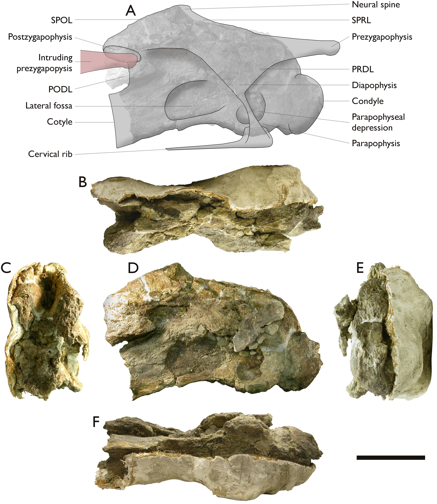
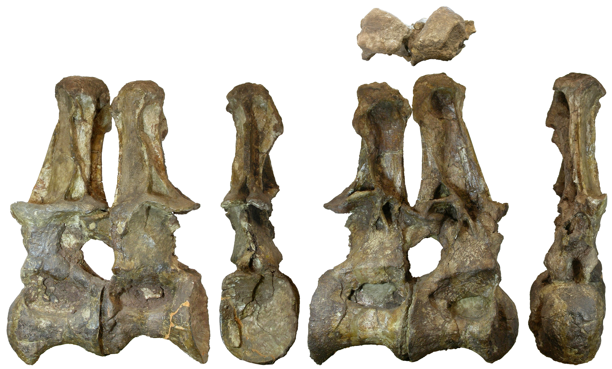
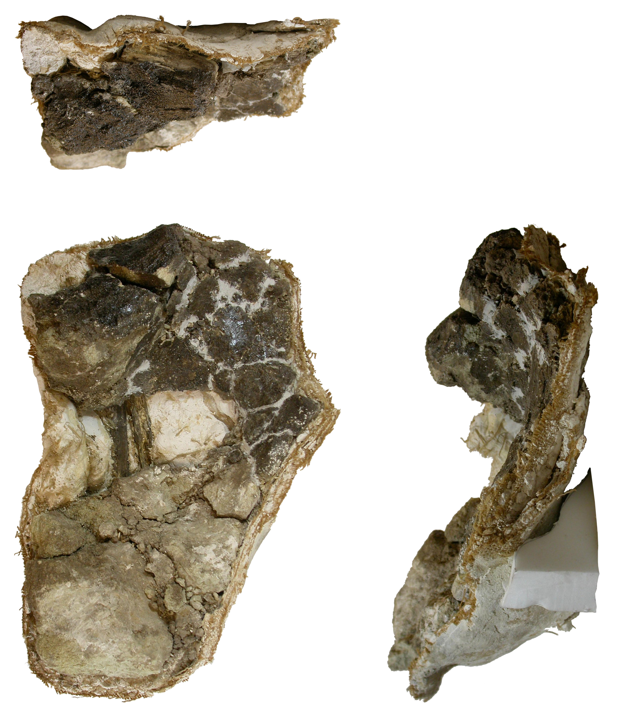

# "The Archbishop", a new sauropod from the Tendaguru Formation (Latest Jurassic) of Tanzania, Africa.

Michael P Taylor.
Department of Earth Sciences,
University of Bristol,
Bristol BS8 1RJ,
UK.
<dino@miketaylor.org.uk>

## Contents

<!-- md2toc -l 2 -s 1 archbishop-manuscript.md -->
* [Abstract](#abstract)
* [Introduction](#introduction)
    * [Institutional abbreviations](#institutional-abbreviations)
    * [Anatomical nomenclature](#anatomical-nomenclature)
* [Historical background](#historical-background)
    * [The German East Africa Expeditions](#the-german-east-africa-expeditions)
    * [The British Museum East Africa Expedition](#the-british-museum-east-africa-expedition)
* [Contemporary accounts](#contemporary-accounts)
    * [Material assigned to the specimen](#material-assigned-to-the-specimen)
    * [Skeletal inventory](#skeletal-inventory)
* [Description](#description)
    * [Catalogue of prepared material](#catalogue-of-prepared-material)
    * [Cervical vertebrae](#cervical-vertebrae)
        * [Cervical V](#cervical-v)
        * [Cervical S](#cervical-s)
        * [Cervical T](#cervical-t)
        * [Cervical U](#cervical-u)
        * [Cervical P](#cervical-p)
        * [Cervical W](#cervical-w)
    * [Cervical ribs](#cervical-ribs)
        * [Cervical rib X1](#cervical-rib-x1)
        * [Cervical rib X2](#cervical-rib-x2)
        * [Cervical rib X3](#cervical-rib-x3)
    * [Dorsal vertebrae](#dorsal-vertebrae)
        * [Dorsal vertebral neural spine C](#dorsal-vertebral-neural-spine-c)
        * [Dorsal vertebral centra Q and R](#dorsal-vertebral-centra-q-and-r)
        * [Dorsal vertebrae A and B](#dorsal-vertebrae-a-and-b)
    * ["Lump Z"](#lump-z)
    * [Scapula N](#scapula-n)
    * [Humerus fragment L](#humerus-fragment-l)
    * [Pubis M](#pubis-m)
    * [Unprepared jackets](#unprepared-jackets)
* [Size and proportions](#size-and-proportions)
* [Comparisons](#comparisons)
* [Phylogenetic analysis](#phylogenetic-analysis)
    * [Character states](#character-states)
* [Systematic Palaeontology](#systematic-palaeontology)
* [Discussion](#discussion)
* [Acknowledgements](#acknowledgements)
* [References](#references)

## Abstract

XXX To follow

## Introduction

The German East Africa expeditions of the Humboldt Museum für Naturkunde in the period before the First World War were among the most ambitious ever undertaken (Maier 2003), and yielded many superb dinosaur skeletons including the type specimens of new sauropod, theropod and ornithischian dinosaurs. After the war, the subsequent expeditions of the British Museum (Natural History) were much humbler affairs, and their results were correspondingly unimpressive. The best specimen -- a large and fairly complete sauropod skeleton -- was excavated and returned to London, but was then largely ignored for the next 75 years. In this paper, I describe this overlooked specimen, assess its affinities, and discuss its implications for sauropod systematics and palaeoecology.

### Institutional abbreviations

* BMNH -- See NHMUK.
* FMNH -- Field Museum of Natural History, Chicago, Illinois, USA.
* HMN -- See MB.
* MB -- Museum für Naturkunde Berlin, Berlin Germany. MB.R. indicates the fossil reptile collection. Formerly HMN, Humboldt Museum für Naturkunde.
* NHMUK -- National History Museum, London, UK. NHMUK PV indicates the vertebrate palaeontology collection. Formerly BMNH, British Museum (Natural History).

### Anatomical nomenclature

Nomenclature for vertebral laminae follows that of Wilson (1999).

The average elongation index (aEI) of a centrum is defined following Chure et al. (2010:385) as its length divided by the mean of its posterior height and width.

To avoid ambiguity, anatomical directions are used of the scapula as though the blade were oriented horizontally, although its orientation in life was more complex and remains controversial.

See below on Migeod's idiosyncratic numbering of the  vertebrae, and on how his numbering scheme corresponds with conventional numbering.

## Historical background

### The German East Africa Expeditions

Between the years of 1907 and 1913, the Humboldt Museum für Naturkunde in Berlin, Germany, sent a series of palaeontological expeditions to Tendaguru in what was then German East Africa (Maier 2003).  These expeditions, led by Werner Janensch, excavated more than 185 tonnes of fossils, mostly dinosaurs.  When prepared, these fossils proved to include spectacularly complete specimens representing several dinosaurian clades: the ceratosaurian theropod _Elaphrosaurus bambergi_ Janensch, 1920, the ornithopod _Dysalotosaurus lettowvorbecki_ Virchow, 1919, the spiked stegosaur _Kentrosaurus aethiopicus_ Hennig, 1915, and several different sauropods: two species of _Dicraeosaurus_ (_D_. _hansemanni_ and _D_. _sattleri_ Janensch 1914), representing the then new family Dicraeosauridae; "_Gigantosaurus_" _africanus_ Fraas, 1908, whose complex affinities are outlined below; and the giant brachiosaurid "_Brachiosaurus_" _brancai_ Janensch, 1914, the mounted skeleton of which is the centerpiece of the exhibition of the Museum für Naturkunde Berlin. (Further species have been named from the Tendaguru formation, but these are based on fragmentary remains.)

The nomenclatural history of the well-represented species has in some cases been complex. Because of its effect on the apparent diversity of dinosaurs in the Tendaguru Formation, this history warrants some explanation.

_Dysalotosaurus_ was synonymised with _Dryosaurus_ Marsh, 1894, by Galton (1977), yielding the combination _Dryosaurus lettowvorbecki_. This was followed
by most authors through the 20th Century, but Scheetz (1999) treated the two genera as separate and Witzmann et al (2008) disputed the synonymy. The genus _Dysalotosaurus_ now seems widely accepted as valid and distinct.

The year after _Kentrosaurus_ was named, its author, noting that the name was similar to and shared its etymology with the ceratopsian dinosaur _Centrosaurus_ Lambe, 1904, proposed the replacement name _Kentrurosaurus_ Hennig, 1916; and Nopcsa (1916) independently proposed the replacement name _Doryphorosaurus_ for the same reason. However, since _Centrosaurus_ is pronounced with a soft "C" and _Kentrosaurus_ with a hard "K", the two are not homonyms, and the original name remains valid, with _Kentrurosaurus_ and _Doryphorosaurus_ being junior objective synonyms.

As recounted in detail by Taylor (2009), Janensch's referral of the species "_Brachiosaurus_" _brancai_ to the North American genus _Brachiosaurus_ Riggs, 1903 was made without having seen material of type species _Brachiosaurus altithorax_ Riggs, 1903, and was based primarily on features which we can now recognise as symplesiomorphies. The referral was questioned by Lull (1911:42), but generally accepted until Paul (1988) noticed proportional differences between the species while executing a skeletal reconstruction, and accordingly proposed subgeneric separation, with the African species becoming _Brachiosaurus_ (_Giraffatitan_) _brancai_. Olshevsky (1991) proposed that the subgenus _Giraffatitan_ be raised to generic rank, but the name was not used in the literature, "_Brachiosaurus_" _brancai_ being retained, until Taylor (2009) demonstrated, based on 26 features that differ from _Brachiosaurus altithorax_, that _Giraffatitan brancai_ is indeed generically distinct, and this usage is now followed.

The name "_Gigantosaurus_" has the most complex history of all. Fraas chose this name in full knowledge that it had already been used for the poorly represented English genus _Gigantosaurus_ Seeley, 1869, but wrongly believing that the name was available as Seeley had not described or figured the material that his own genus was founded on. He named the type species _G_. _africanus_ and referred a second species, _G_. _robustus_. Recognising Fraas's error in using a preoccupied name, Sternfeld (1911) renamed the German genus _Tornieria_, the two species becoming _T_. _africana_ and _T_. _robusta_. Janensch (1922), however, continued to use the older name "_Gigantosaurus_", but observed in a footnote that differences such as possession of bifid neural spines in "_G_". _africanus_ and single spines in "_G_". _robustus_ required generic separation. Believing the type species "_G_". _africanus_ to belong to the North American genus _Barosaurus_ Marsh, 1890, Janensch referred to the two species as _Barosaurus africanus_ and _Gigantosaurus robustus_. The latter name would have been invalid even if the genus _Gigantosaurus_ had not been preoccipied, since its type species had been removed making _Gigantosarus_ a junior subjective synonym of _Barosaurus_; however, Janensch did not refer the remaining species _robustus_ to a new genus as he should have done. This was eventually done by Wild (1991), who placed the species in the new genus _Janenschia_ as _J_. _robusta_, and assigned it to Titanosauria. Bonaparte et al (2000), however, noted that the axial material assigned to _Janenschia_ was not convincingly associated with the appendicular type material, and removed this material to another new genus, _Tendaguria_. They considered _Janenschia_ to be a camarasaurid and _Tendaguria_ to belong to its own monogeneric family due to the very unusual morphology of the dorsal vertebra on which is was based. Janensch's referral of the _Tornieria africana_ material to _Barosaurus_ was mostly followed, but McIntosh (2005) questioned this, considering it more similar to _Diplodocus_ and not convincingly congeneric with either. Remes (2006) restudied this material and concluded that it represents a distinct genus for which he resurrecting the available name _Tornieria_, which now contains only the single species _T_. _africana_. Remes (2007) subsequently noted that two cervical vertebrae that had been referred to this species were distinct, and referred them to the new genus _Australodocus_, which he considered to be diplodocid, but which recent phylogenetic analyses recover as a titanosauriform (e.g. Whitlock 2011, Mannion et al. 2019). Finally, a caudal sequence previously referred to Janenschia was found to be mamenchisaurid and so placed in a yet another new genus _Wamweracaudia_. In conclusion, the two species of "_Gigantosaurus_" are now considered to belong to five distinct monospecific genera: _Tornieria_, _Janenschia_, _Tendaguria_, _Australodocus_ and _Wamweracaudia_, representing respectively a diplodocid, two turiasaurs, a basal somphospondyl and a mamenchisaurid (Mannion et al. 2019).

### The British Museum East Africa Expedition

German operations in East Africa were interrupted by the Great War (1914-1918), during which the territory of German East Africa changed hands and became the British protectorate of Tanganyika. Aware of the impressive results of the German expeditions, the British Museum (Natural History) began in 1920 to plan expeditions of their own, hoping to obtain display-quality specimens comparable to those that were starting to emerge from Berlin. After a series of delays, the expeditions finally commenced in 1924, under the leadership of William Cutler assisted by Louis Leakey. Cutler died in the field in 1925, having obtained only fragmentary material, and was replaced by Frederick W. H. Migeod in late 1925 and through 1926. Migeod had extensive experience in Africa, first in the colonian civil service in Nigeria and Ghana, and then as an explorer, crossing the continent twice on foot. His main interest was in African languages, and he published several books and academic articles on western African languages.

However, Migeod was not a palaeontologist, and his work at Tendguru was impeded by his lack relevant experience and expertise (see below). For this reason he was himself replaced by John Parkinson for the 1927 and 1928 field seasons. For reasons that are unclear, Parkinson's contract was not renewed in 1929. Consequently Migeod returned, to be joined in 1930 by a new assistant, Francis R. "Rex" Parrington, assistant superintendant of the Cambridge University Museum of Zoology. By this stage, the BMNH had been excavating in Tendaguru for six years with little to show for it: there were plenty of isolated bones, but no skeleton complete enough to compare with the spectacular German material.

The 1930 field season, however, was more suggessful. Migeod and his team excavated quarry M 23, and so yielded the specimen that the BMNH had been awaiting. Although Migeod was 58 by this time, he supervised the excavation of a large, fairly complete and partially articulated sauropod skeleton, since catalogued as BMNH R5937, now NHMUK PV R5937. Although this material seemed to meet the BMNH's requirement for a display-quality specimen, it remained largely unprepared and was described only in an informal account of the 1930 field season (Migeod 1931a), a paper written without having seen any of the material prepared, and which is figured only with field photographs and a quarry map. Several subsequent popular accounts (Migeod 1931b, Migeod 1931c, Parrington 1931) added little information.

Despite the fruitfulness of the 1930 field season, the BMNH did not return to Tendaguru to seek additional material in subsequent years. Migeod's (1931b) account ends with the somewhat plaintive observation "Now Tendaguru is abandoned. I disposed of the equipment in accordance with instructions and left for England in January." And that remains the final word.

Despite its completeness of Migeod's specimen and the good preservation of some of the material, it has been consistently neglected in the intervening decades: much of what was collected has been lost, some of what remains has yet to be prepared, and the prepared material has never been properly studied. When in the early 1960, John S. McIntosh expressed an interest in studying the material, he was discouraged a letter sent by W. E. Swinton which read (in part): "I feel rather sad at your quest for I knew Migeod very well and had much sympathy with him but alas, I knew the material he collected even better [...] The few good bones he collected would not constitute a single limb and but a few feet of backbone. Indeed, much of East Africa was enclosed in plaster with the mistaken impression that bone was contained within. You will not, therefore, see any monographs on the specimen and you can dismiss his particular dinosaur from your mind" (unpublished letter). Swinton's dismissal is puzzling, contradicting Migeod's own account of the material and, as will become clear, greatly underestimating its value.

What few references there have been to NHMUK PV R5937 in the literature have often used incorrect specimen numbers and mischaracterised the material – for example, Paul (1988) and Glut (1997) refer to specimen "BMNH M 23", using the quarry number as a specimen number. 

## Contemporary accounts

As an explorer and linguist, Migeod's palaeontological skills were not his strongest point, and he was not well respected as a scientist by his peers. Charig's (1990) memoir of his Tendaguru assistant Francis "Rex' Parrington tells us "Parrington [...] soon discovered that Migeod's pretensions concealed a profound ignorance of many subjects, and thereafter he delighted in setting deliberate verbal traps for Migeod, into which Migeod invariably fell" (p363). Charig further says that "the expedition  (no fault of Parrington's) was ill-conceived and ill-prepared" (p364). Parrington later described Migeod as "a charlatan" (Arthur Cruickshanks, pers. comm., 2005). After visting the BMNH's then sparse Tendaguru collection, Friedrich von Huene wrote in a 1927 letter to Wener Janensch, wrote "Spoke with Migeod who last excavated at Tendaguru [...] Migeod does not have the slightest notion of palaeontology" (Maier 2003:199). Even the BMNH's own director Sidney Harmer wrote to the museum trustees "Mr. Migeod has done his work admirably, but it appears that he has not the special knowledge of Palaeontology which is required to make the work a complete success [...] he appears to be willing to admit that he is not a Palaeontologist" (Maier 2003:199).

Migeod's only significant publication about the Tendaguru sauropod is his brief description in the BMNH's _Natural History_ magazine (Migeod 1931a), and indeed his reporting is in places haphazard: only a random smattering of measurements are given, and these are sometimes inconsistent: for example, on page 92 he gives the length of the "shoulder vertebra" (see below) as 24 inches, then four sentences later as 23 inches. Nevertheless, his account gives a good idea of the material that existed and was excavated, and allows us to draw conclusions about what must have been lost or destroyed between then and now.

> **Figure D.** A map of the site, quarry M 23, where NHMUK PV R5937 was found. Modified from Migeod (1931a:figure 1). The bones that have been prepared and are available for study are highlighted in pink. The humeri, though mentioned in Migeod's account as being "at the extreme end" of the scapula, are not included in his site map. They are added here in pale grey, scaled from that of _Giraffatitan brancai_ MB.R.2181 (formerly HMN SII), as illustrated by Janensch (1961:beilage A:part 1a).

Tree roots had damaged the skeleton mostly in the sacral region (Migeod 1931a:88). A damp layer ran through the skeleton so that "while the highest and the lowest bones were hard, the intermediate section was powdery" (Migeod 1931a:88), and corroding impregnation of iron had done considerable damage. It is noticeable in the prepared material that different bones are preserved very differently.

Migeod's numbering of the vertebrae of this specimen was idiosyncratic. Rather than number the cervicals starting at C1 for the atlas and increasing backwards, he designated a single "shoulder vertebra", and counted both cervical vertebra forward from this zero-point, and dorsal vertebrae backwards. The sequence of vertebrae from posterior neck backwards, then, using Migeod's numbering, was ... C3, C2, C1, 0, D1, D2, D3.

When referring to cervical vertebra numbers as assigned by Migeod, I use the form mC<i>n</i> to mean "the vertebra designated C<i>n</i> by Migeod"; and when referring to dorsal vertebra numbers as assigned by Migeod, I use the form mD<i>n</i> to mean "the vertebra designated D<i>n</i> by Migeod".

The identity of the "shoulder vertebra" can be established, though with some uncertainty, by its dimensions and those of the vertebrae either side. Migeod (1931a:91-92) says mC1 is 33 inches long, the shoulder vertebra 23 inches, and D1 11 inches long; and that mC3 is the longest vertebra at 41 inches (104 cm). This makes the shoulder vertebra 56% the length of of the longest cervical. In the _Giraffatitan brancai_ paralectotype MB.R.2181 (formerly HMN SII), the longest vertebrae are C10 and C11, at 87 cm (excluding the condyle). 56% of this is 49 cm, which is a good match for the length of D1 at 46 cm -- at least, a much better match than for C13 (67 cm) or D2 (36 cm). On this basis, the "shoulder vertebra" of Migeod's usage is most likely D1, and the ratios of vertebral length of the two vertebrae either side of (143% for C13, 48% for mD1) are comparable with the corresponding ratios in MB.R.2181 (146% for C13, 78% for D2). The reduction in length from D1 to D2 in the Archbishop is more abrupt than in MB.R.2181, but these numbers must be treated with caution: while Janensch carefully gave these lengths as those of the vertebra centra not including the condyles, Migeod referred only to "length", not specifying whether it included the overhanging prezygapophyses, the condyles, or neither.

Nevertheless, I will proceed on the assumption that Migeod's "shoulder vertebra" is D1. Assuming, then, that the Archbishop had thirteen cervicals, then mC<i>n</i> is C(14-_n_), so mC3 is C11; and mD<i>n</i> is D(_n_+1), so mD7 is D8.

The most intriguing part of Migeod's description pertains to the taxonomic identity of the specimen. Although he designates the specimen as being "of the _Brachiosaurus_ type" (Migeod 1931a:87), he also writes "The anterior dorsal vertebrae apparently had their neural spines in two parts, which led me at first to the opinion that this dinosaur was a _Dicraeosaurus_.  This view proved on further excavation to be untenable, and indeed the bifurcate spines were similar to neither species of _Dicraeosaurus_ found at Tendaguru by the Germans" (Migeod 1931a:93). Unfortunately, none of the bifid-spine material has survived and been prepared, so it is currently impossible to directly verify this aspect of the morphology. Jackets G and H contain portions of mD3 (D4) (see below), so preparation of these may cast light on Migeod's claims. At any rate, the specimen has been universally assumed to belong to _Giraffatitan_ (formerly _Brachiosaurus_) _brancai_, despite the doubt cast by the bifid neural spines in the anterior dorsal vertebrae.

Aside from his _Natural History_ article, Migeod wrote two further accounts of the work in Tendaguru, in the _Times_ newspaper (Migeod 1931b) and in _Discovery_ magazine (Migeod 1931c). However, these contain very little information not in the _Natural History_ article, and seem to be primarily condensations of that article. Parrington's (1931) single-page article in the _Illustrated London News_ likewise contains no additional descriptive information, but it does include several useful photographs, including one of the right scapula that is reproduced better than the similar photo in Migeod (1931a:figure 2), and two photos that offer tantalising hints of the "wings" of the dorsal vertebrae (see below).

### Material assigned to the specimen

Migeod notes that although no skull bones were recovered (nor the four or five most anteror cervicals), "a large tooth was, however found, measuring 6½ inches in length with a maximum circumference of 5¾ inches, which would indicate that the head was large" (Migeod 1931a:90), but since the tooth was pointed is must have belonged to a scavenging theropod rather than to Migeod's sauropod -- a possibility that Migeod allowed -- and so tells us nothing about the animal in question.

Migeod's accounts directly reference many more bones than are presently available for study. Table 1 summarises the bones Migeod reported having found, the sizes he gave for them (where specified), and assignments of the prepared elements to serial positions.

**Table 1. Material found by Migeod**

Element                    | Measurements (inches) | Present?                 | Prepared? | Note
:------------------------- | :-------------------- | :----------------------- | :-------- | :---
large tooth                |                       |                          |           | Probably from a theropod
two small teeth            |                       |                          |           | Probably from a theropod
mC9 (C5)                   |                       | Jacket M                 |           |
mC8 (C6)                   |                       | Cervical V?              | Yes       |
mC7 (C7)                   |                       | Cervical S?              | Yes       |
mC6 (C8)                   |                       | Cervical U?              | Yes       |
mC5 (C9)                   |                       | Cervical T?              | Yes       |
mC4 (C10)                  | 39" long, 23" tall    | Cervical P?              | Yes       |
mC3 (C11)                  | 41" long              | Cervical W; Jackets E, I | Part      |
mC2 (C12)                  |                       |                          |           |
mC1 (C13)                  | 33" long, 44" tall    |                          |           |
Cervical ribs              |                       | X1, X2, X3               | Yes       |
"Neck tendons"             | Up to 97.5" long      | X                        | Yes       | Fragments only
"Shoulder vertebra" (D1)   | 24" long, 39" tall    |                          |           |
mD1 (D2)                   | 14"                   |                          |           |
mD2 (D3)                   | 11"                   |                          |           |
mD3 (D4)                   | 10.5" long, 39" tall  | Jackets G, H             |           | _Discovery_ says `9-11"`
mD4 (D5)                   |                       | Dorsal Q and spine C?    | Yes       |
mD5 (D6)                   | 11" long, 38" tall    | Dorsal R?; Jacket S      | Yes       |
mD6 (D7)                   |                       | Jacket Q                 |           |
mD7 (D8)                   |                       | Dorsal A?                | Yes       |
mD8 (D9)                   |                       | Dorsal B?                | Yes       |
mD9 (D10)                  | 34" tall              | Jacket D? Lump Z?        | Partially |
mD10 (D11)                 | 9"                    | Lump Z?                  | Partially |
mD11 (D12)                 | (maybe)               |                          |           |
Dorsal ribs                | Up to 92.5" long      |                          |           |
Sacral vertabrae (damaged) |                       | Jacket P?                |           |
Caudals 1-9                |                       |                          |           |
Left scapulocoracoid       | 87" long, 26" wide    | N1, N2, N3; Jacket O     | Yes       | Partial
Left humerus               | 57.5" long, 20" wide  |                          |           |
Right humerus              | 57.5" long, 20" wide  | Humerus L                | Yes       | Fragment
Radius                     |                       |                          |           | Head only
Right ilium                | 38.5" long, 31" tall  | Jacket F                 |           |
Ichium (broken)            |                       |                          |           |
Pubis (ends only)          |                       | Pubis M                  | Yes       |
1st femur (damaged)        | 48" approx            |                          |           | Field Report #3 says 42"
2nd femur (partial)        |                       |                          |           |
Calcaneum                  |                       |                          |           | Migeod (1931a:95)
Unidentified bone          | 26.5x25"              |                          |           |

Not all serial positions can be definitely established, but most can be inferred with some confidence.

Regarding the cervicals, Migeod (1931a:91) noted that "C4, 5 and 6 were separated by short intervals, but 7, 8 and 9 were adering to one another. All of these were in vert good condition, and were plastered separately without cutting to reduce size", but that other cervical vertebra had to be cut into pieces. The still-unprepared Jacket M contains mC9  (i.e. C5), so the five intact cervicals that have been prepared (cervicals V, S, U, T and P), none of which show signs of having been assembled from multiple jackets, must be the other five complete cervicals: mC4-mC8, i.e. C10-C6. In this middle section of the neck, cervicals length increase posteriorly in all sauropods, so based on the measured centrum lengths of cervicals V, S, U, T and P (58, 72, 80, 85 and 90 cm respectively), they were most likely in this serial order.

This assignment raises a difficulty: Migeod's stated measurements of mC4 (C10) are 39 inches in length and 23 inches in height. Cervical P's centrum measures only 90 cm (35 inches). However, the total lenth of the vertebra, including the overhanging prezygapophyses, is 99 cm (39 inches), and its total height (from the tip of the neural spine down to a line joining the ventral margins at the anterior and posterior ends of the vertebra) is 56.5 cm (22.2 inches), both of which are good matches for Migeod's measurements. Unfortunately, Migeod nowhere stated what he meant by the "length" of a vertebra, but it seems likely, based on the measurements of Cervical P, that he did include the prezygapophyses.

Regarding the dorsals, the well-preserved conjoined pair A and B can be positioned by reference to Migeod (1931a:92): "All the dorsal vertebrae [...] were with one exception adhering very firmly to each other [...] The exception was a break between D6 and D7. [...] After extracting D7, however, together with D8 (which were plastered together so that there might be no disturbance of the interlocking neural arches) [...]". From this, it seems highly likely that A and B and mD7 and mD8 (i.e. D8 and D9). This assignment to a posterior position within the dorsal column is corroborated by the high position of the parapopysis on both vertebrae.

Centra Q and R measure 26 and 29 cm (10 and 11 inches) from the back of the condyle to the cotyle. The shortness of the centra rules out either of them being Migeod's "shoulder vertebra", mD1 or mD2. mD3 is still contained in Jackets G and H, and mD6 in Jacket Q; and mD7 and mD8 are dorsals A and B. Therefore the only possible positions for centra Q and R are as mD4-mD5, or posterior to A and B as mD9 and mD10 -- that is, D10 and D11, the two most posterior dorsals. But on most sauropods, that last few dorsals the shortest, and centra Q and R are slightly longer than the centra of dorsals A and B. A very posterior position is therefore unlikely, and the position as mD4 and mD5 (i.e. D5 and D6) seems most likely.

Dorsal neural spine C may belong to either centrum Q or R; but since the as-yet unopened Jacket S contains part of mD5, it seems most likely that it belongs to mD4, i.e. dorsal centrum Q -- but this assignment is by no means certain.

Finally, the position of Lump Z is very difficult to determine. It contains indeterminate processes, probably those of dorsal vertebrae. Although it is quite possible that they are lateral processes, they seem most likely to be two neural spines, presumably from consecutive vertebrae. Since Migeod repeatedly claimed that the anterior dorsal vertebra had bifid neural spines resembling those of _Dicraeosaurus_, we can conclude the Lump Z does not contain such bifid spines and thus likely belongs to more posterior dorsals such as mD9 and mD10 (D10 and D11).

### Skeletal inventory

> **Figure E.** Skeletal inventory of NHMUK PV R5937, "The Archbishop", showing which bones were excavated by Migeod' expedition. Based on a skeletal reconstruction of _Giraffatitan brancai_ kindly provided by Scott Hartman: note that this image does _not_ illustrate the shapes or proportions of the Archbishop material. Bones prepared and available for study are shown in white; those still in jackets awaiting preparation in light grey; those excavated by Migeod but apparently lost or destroyed in dark grey.

In illustrating the excavated material, some choices had to be made:

* While Migeod (1931a, b, c) only mentions vertebrae as far forward as mC9 (C5), the label attached to Jacket M says "cervical vertebra 9 and a fragment of 10", so I have shown the posterior portion of C4 as present.
* Apart from the sequence of the nine most proximal caudal vertebrae, Migeod (1931a:94) mentions that "a small vertebra 2 to 3 inches long was found near the humeri, and later stll anotheron 13/16ths of an inch long in the tail region". He considered these likely a part of the specimen, so I show one mid-caudal and one distal caudal as well as proximal sequence.
* "Of the lower limbs only the doubtful head of a radius was found" (p94). I have depicted the head of right radius as present, since the only preserved part of a forelimb is probably from the right humerus.
* Of the humeri, Migeod (1931a:95) says "whilst one was sound, half of the other powdered away", but does not specify which humerus was sound. Since the preserved humeral portion seems to be from the right humerus, I have depicted the lower half of the right humerus as absent.
* "One femur was found, measuring about 4 feet. Being in bad condition its exact length could not be ascertained [...] Of the other femur only parts were recovered" (p95). Based on this description, I have arbitrarily shown the left femur as present (but with the distal end damaged) and the right as absent. 
* Migeod (1931a:95) writes "it is possible that some uncertain fragments may be part of a sternum", but given this level of uncertainty I have not shown a sternal plate as present.
* Migeod (1931a:95) says "nor was any part of the feet found, except a calcaneum". This seems doubtful, as the calcaneum is rarely ossified in sauropods, and not often collected. However, I have shown the left calcaneum as present.
* Migeod (1931a:95) describes finding "an ischium of large size, but broken into segmnts of an inch or two each way", noting that "the joining up of these pieces occupied a considerable time". He does not specify whether it was the left or right ischium. The skeletal inventory shows the left ischium as having been present, since that is the only one visible in lateral view.
* Only the proximal part of the pubis is present among the prepared elements, but Migeod (1931a:95) says that "the ends" were found, implying that the distal portion was present, too.
* Migeod (1931a:96) says that the left ilium was found, but also notes the presence of a flat bone 26½ inches by 25 in the region which we was unable to identify. It seems reasonable to think was part of the ilium. In any case, I have depicted the left ilium as present, since the right ilium is obscured in left lateral view.
* Migeod (1931a:96) notes that, while many or all of the right-sided dorsal ribs were recovered, only some of those on the left were found. I have illustrated a representative sample of left dorsal ribs as being present.
* Finally, for all of the material that remains in jackets awaiting preparation, I had to guess blindly what portion of the bones might be present.

## Description

### Catalogue of prepared material

Many of the elements that were prepared long age have either Migeod's quarry number M 23 painted directly on them, or the specimen number R 5937 written on a small, round yellow label firmly fixed to the bone, so their inclusion in the hypodigm is easy to establish.

Since the serial positions of vertebrae are not possible to determine with confidence, the various elements have been assigned letters. The letters were assigned piecemeal some time ago, and are no particular order. They convey no implication of serial position. Available material of the Archbishop is summarised in Table 2.

**Table 2. Available material**

Name | Element               | Description
:--- | :-------------------- | :----------
V    | cervical vertebra     | Small, anterior cervical vertebra, still half-jacketed. Poorly presered and very fragile. 
S    | cervical centrum      | Large cervical vertebral centrum, almost all of the neural arch and ann processes missing.
T    | cervical centrum      | Large cervical vertebral centrum, almost all of the neural arch and ann processes missing.
U    | cervical vertebra     | Large, well preserved cervical vertebra, half-jacketed with the right side and anterior/posterior extremities exposed.
P    | cervical vertebra     | Large cervical vertebra, well preserved in places, but obscured by poorly executed restoration.
W    | ?cervical vertebra    | Unprepossessing lump of bone from posterior cervical, difficult to interpret
X    | cervical rib framents | Portions of cervical rib shafts, impossible to associate convincingly with X1-X3.
X1   | cervical rib          | Proximal portion of left cervical rib, reasonably well preserved.
X2   | cervical rib          | Proximal portion of right cervical rib, poorly preserved.
X3   | cervical rib          | Proximal portion of right cervical rib, poorly preserved.
C    | dorsal neural spine   | Isolated neural arch and spine from a dorsal vertebra.
Q/R  | dorsal centra         | Conjoined consecutive pair of dorsal vertebral centra.
A/B  | dorsal vertebrae      | Conjoined consecutive pair of well-preserved essentially complete dorsal vertebrae.
Z    | semi-prepared jacket  | Difficult-to-interpret set of bones, almost certainly vertebral processes.
N    | scapula               | Three pieces of mostly uninformative flat bone.
L    | humerus fragment      | Portion from the shaft of a limb bone, both ends missing.
M    | ?pubis                | Portion of a bone with a complex shape.

In addition, there are a dozen or so as-yet unopened jackets from the Migeod expedition (see below).

### Cervical vertebrae

In general, the cervical vertebrae are about as elongate as those of _Giraffatitan_, with the aEI of the two cervicals for which this can be calculated nicely bracketing the aEI of the large C8 that is the only vertebra of MB.R.2181 that can be measured (Table 3).

As (Migeod 1931a:90) pointed out, "the neck was deep rather than broad". This is seen partly in his measurements of the more or less intact cervical vertebrae he was dealing with: the last cervical was 1.33 times as tall as it was long (44 inches to 33 inches). Unfortunately, the more posterior cervicals are not available, having apparently been lost or destroyed, so these unusual dimensions cannot be verified or further interpreted. However, the tallness of the cervicals (and indeed dorsals) is also reflected in the proportions of the centra: in every Archbishop vertebra for which both height and width of the cotyle can be measured, it is taller than it is wide (Table 3) -- a reversal of the condition in most neosauropods and particularly in _Giraffatitan_ (character 17 state 1 in the phylogenetic analysis).

**Table 3. Cervical vertebral dimensions and ratios**

Vertebra  | Centrum length | Cotyle height | Cotyle width | H/W ratio | aEI
:-------- | :------------- | :------------ | :----------- | :-------- | :--
**_Giraffatitan_ MB.R.2180 (SI)**
C2        | 23.2           | 10            | 8.2          | 1.23      | 2.55
C3        | 30.6           | 11.6          | 12.3         | 0.94      | 2.56
C4        | 45.7           | 13.8          | 13.2         | 1.05      | 3.39
C5        | 56             | 15.2          | 17.8         | 0.85      | 3.39
C6        | 69.1           | 15            | 22.1         | 0.68      | 3.73
C7        | 70.5           | 22.5          | 19.8         | 1.14      | 3.33
_Average_ |                |               |              | 0.98      | 3.16
**_Giraffatitan_ MB.R.2181 (SII)**
C3        |                | 14.2          | 16.3         | 0.87
C4        |                |               | 20.4
C5        | 81
C6        | 90             |               | 29.0
C7        | 93             |               | 29.4
C8        | 98             | 24.4          | 24.7         | 0.99      | 3.99
C9        | 98             |               | 35.2
C10       | 100            |               | 40.6
C11       |                |               | 43.8
C12       |                |               | 47.2
C13       |                |               | 46           | 0.93      | 3.99
_Average_ | XXX
**"The Archbishop" NHMUK PV R5937**
V (C?6)   | 57
S (C?7)   | 75             | 20            | 18           | 1.11      | 3.95
U (C?8)   | 80
T (C?9)   | 81             | 22            | 
P (C?10)  | 90             | 23            | 22           | 1.05      | 4.00
_Average_ |                |               |              | 1.08      | 3.98

> Dimensions of cervical vertebrae of _Giraffatitan_ and the Archbishop, and ratios expression cotylar eccentricity (H/W ratio) and elongation (aEI). Measurements for _Giraffatitan_ are taken from Janensch (1950:39, 44).

However, the cervical vertebrae of the Archbishop are significantly less pneumatic than those of _Giraffatitan_. For example, character 406 in the phylogenetic analysis (see below) is "Middle and posterior cervical neural spines, lateral surface between PRDL, PODL, SPOL (i.e. the spinodiapophyseal fossa [SDF]): has 3 or more coels separated from each other by low ridges". This feature is present for _Giraffatitan_ but absent for the Archbishop.

XXX comparative illustration

XXX more general observations?

#### Cervical V

> **Figure V.** NHMUK PV R5937, "The Archbishop", cervical vertebra V (most anterior preserved cervical vertebra, probably C6), left side still encased in plaster.
> **A.** Reconstruction of right lateral view with neural spine, prezygapophysis, diapophysis, condyle, cotyle and cervical rib restored. The prezygapophysis from the succeeding vertebra that has adhered to this element is shown in red.
> **B.** Dorsal view with anterior to the right.
> **C.** Posterior view.
> **D.** Right lateral view.
> **E.** Anterior view.
> **F.** Ventral view with anterior to the right.
> Scale bar 20 cm.
> Abbreviations:
> PODL, postzygadiapophyseal lamina;
> PRDL, prezygadiapophyseal lamina
> SPOL, spinopostzygapophyseal lamina;
> SPRL, spinoprezygapophyseal lamina.

The cervical vertebra designated V is the most anterior of these that have been prepared, and is tentatively assigned to position 6 in the vertebral column (Migeod's mC8). It cannot be C5 (mC9), as that element remains in jacket M. It is unfortunately in very poor condition, and consequently could not be entirely removed from its jacket. It lies on its left side, so that the right lateral aspect is visible.

The maximum height is 40 cm, measured from the tip of the neural spine to a baseline drawn between the parapophysis and the the posterior margin of the centrum. The preserved length of the vertebra when the photographs were taken was 57 cm.; however, the most posterior part of the centrum is missing, and would likely have increased the length by 5 cm or so. The cotyle can therefore not be measured, and cotylar eccentricity and aEI cannot be calculated. This vertebra has crumbled further since the photographs were taken, and the subsequent breakage in the middle of the vertebra has misleadingly increased the apparent length by about 6 cm.

Both postzygapophyses are preserved (although the left one remains in plaster), along with the spinopostzygapophyseal laminae, which are robust, and the neurapophysis. Only a portion of the right spinoprezygapophyseal lamina remains, and both prezygapophyses are lost. The shallow trajectory of all these laminae and correspondingly low neural spine conform well to the shape of of the spine in similarly anterior cervicals of _Giraffatitan_ -- compare with MB.R.2180:C6. The base of the prezygadiapophyseal lamina is present, and comparing its position and trajectory with those of the preserved portion of spinoprezygapophyseal lamina indicates that the prezygapophysis was located some way anterior to the condyle, which matches the condition in _Giraffatitan_.

The condyle is present but damaged: the ventrolateral part is in fair condition, but further dorsally and medially it is broken. Both the diapophysis and parapophysis are present (and the shape of the jacket shows that the left parapophysis is also in place, though inaccessible). The diapophyseal process includes a section projecting ventrally to meet the head of the cervical rib, which is absent (unless cervical rib X2 or X3 belongs to it: see below). As noted above, the base of the lamina connecting the diapophysis to the prezygapophysis is present, though damaged; so is the lamina connecting to the postzygapophysis, though here the damage is even greater and the trajectory cannot be confidently determined. The parapophysis is fairly robust, and excavated from above by a broad, uniform depression which shades into the anterior end of the lateral fossa of the centrum. This, too, is broad and fairly shallow. There are no accessory fossae in the centrum or, so far as preservation allows observations to be made, in the neural arch.

In ventral aspect, the posterior part of the centrum is deeply excavated. This concavity is also present more anteriorly, but is less developed.

> **Figure V2.** NHMUK PV R5937, "The Archbishop", cervical vertebra V in posterior view, red-cyan anaglyph.

Migeod (1931a:91) noted that "C4, 5, 6 were separated by short intervals, but 7, 8 and 9 were adhering to one another". Cervical V, being probably C6, corresponds to mC8 of Migeod's usage, meaning that its anterior and posterior neighbours were both adhered to it. This accounts for the poor condition of the condyle and also explains what at first I thought was a strange feature of the posterodorsal part of the vertebra. A chunk of bone hangs down below the right postzygapophysis, and its anterior margin is oriented anteroventrally so that it and the postzygadiapophyseal lamina provide the posterior and dorsal margins of what appears to be a unique fossa. In fact, the bone beneath the postzygapophysis is the incompletely prepared anteriormost portion of the prezygapophysis of the succeeding vertebra, adhering to Cervical V; and the fossa is the usual excavation below the postzygadiapophyseal lamina and above the centrum. Since Cervical S is most likely C7, the prezygaphysis probably belongs to it.

#### Cervical S

> **Figure S.** NHMUK PV R5937, "The Archbishop", cervical vertebra S. Top row: left lateral view; second row: dorsal view (anterior to right); bottom row (left to right): posterior, right lateral, and anterior views.

XXX Measurements for Cervical S: 72cm right lateral length (cotyle margin to condyle).  Local maxima in vertical height 31cm (parapophysis to dorsal eminence which may be supraprezygopophyseal lamina) and 35cm from PCPL to the highest preserved part of the spine, which is broken near the top.  18cm across cotyle (vertical). 18cm across cotyle (horizontal) also. But OLD/new-visit measures it as 72cm.

> **Figure S2.** NHMUK PV R5937, "The Archbishop", cervical vertebra S in right posterolateral view, red-cyan anaglyph.

> **Figure S3.** NHMUK PV R5937, "The Archbishop", cervical vertebra S in posterior view, close-up of postzygapophyses, ?hyposphene and neural canal, red-cyan anaglyph.

XXX To follow

#### Cervical T

> **Figure T.** NHMUK PV R5937, "The Archbishop", cervical vertebra T. Top row: left lateral view; second row: dorsal view (anterior to right); bottom row (left to right): posterior, right lateral, and anterior views.

XXX Cervical T is about 80cm long, but too awkwardly located to measure more fully. It is in poor condition. But OLD/new-visit measures it as 85cm.

> **Figure T2.** NHMUK PV R5937, "The Archbishop", cervical vertebra T in anterior view, red-cyan anaglyph.

XXX To follow

#### Cervical U

> **Figure U.** NHMUK PV R5937, "The Archbishop", cervical vertebra U. Top row: dorsal view; middle row (left to right): posterior, right lateral, and anterior views; bottom row: ventral view.

XXX Cervical U is approximately 81cm long. But OLD/new-visit measures it as 79cm.

XXX To follow

#### Cervical P

> **Figure P.** NHMUK PV R5937, "The Archbishop", cervical vertebra P. Top row: left lateral view; second row: dorsal view (anterior to right); bottom row (left to right): posterior, right lateral, and anterior views.

"No 5" is painted on the left dorsolateral aspect of the posterior end of this vertebra in white paint.  This may represent Migeod's observation of the position it was found in, indicating that it is the fifth most proximal cervical (i.e. C9 if the neck has thirteen vertebrae like _Giraffatitan_), but may only be a field number. XXX consider implications for serial positions in table above.

XXX Its length from condyle to cotyle is about 90cm, but it's hard to measure accurately while it's behind the dorsals. The cotyle height is estimated at 22 cm. OLD/new-visit also measures it as 90cm.

XXX To follow

#### Cervical W

> **Figure W.** NHMUK PV R5937, "The Archbishop", cervical vertebra W. On the assumption that the middle part of this illustration is right lateral, the parts are as follows. Top row: dorsal view (anterior to left); middle row (left to right): posterior, right lateral and anterior views; bottom row: ventral view (anterior to right).

XXX Jacket said "C3".

XXX To follow

### Cervical ribs

> **Figure X.** NHMUK PV R5937, "The Archbishop", cervical ribs and fragments. In the middle of the bottom part of the illustration is left cervical rib X1 (see below), here seen in dorsomedial view with anterior to the bottom right; at the top right, just below the horizontal rib shaft, is right cervical rib X2 (see below), here seen in dorsomedial view with anterior to the left; at the bottom left, to the left of X1, is right cervical rib X3 (see below), here seen in dorsomedial view with anterior to the left. Elsewhere in the box are fragments of rib shaft, some of which may belong to X1, X2 or X3.

XXX These are described as ossified tendons and were long. Rescore the character for CR length.

XXX To follow

#### Cervical rib X1

> **Figure X1.** NHMUK PV R5937, "The Archbishop", left cervical rib X1. Top row: anterior view (dorsal to left, medial to bottom); middle row (left to right, all with anterior to top): lateral, dorsal, medial, ventral; bottom row: posterior (dorsal to left, medial to top).

XXX To follow

#### Cervical rib X2

> **Figure X2.** NHMUK PV R5937, "The Archbishop", right cervical rib X2. Top row: anterior view (dorsal to right, medial to bottom); middle row (left to right, all with anterior to top): ventral, medial, dorsal, lateral; bottom row: posterior (dorsal to right, medial to top).

XXX To follow

#### Cervical rib X3

> **Figure X3.** NHMUK PV R5937, "The Archbishop", right cervical rib X3. Top row: anterior view (dorsal to right, medial to bottom); middle row (left to right, all with anterior to top): ventral, medial, dorsal, lateral; bottom row: posterior (dorsal to right, medial to top).

XXX To follow

### Dorsal vertebrae

XXX To follow

XXX Migeod speaks of the dorsal vertebrae having "wings". FMNH P25107's presacral P7 shows an "apron" similar to that of SII.D?7 -- a wide, contiguous set of horizontal laminae joining prezygs to diapophyses and postzygs.  This morphology is unusual, and may be what Migeod refers to as "wings".

XXX Discuss his confusion as to dicraeosaurid or brachiosaurid identity based on bifid anterior dorsals, and wings, and forward sloping.

#### Dorsal vertebral neural spine C

> **Figure C.** NHMUK PV R5937, "The Archbishop", dorsal neural spine C. Top row: dorsal view (anterior to top); middle row (left to right): anterior, left lateral, posterior, right lateral; bottom row: ventral (anterior to bottom).

XXX To follow

XXX When I have recovered measurements of this both this and A+B, I will be able to score character C158: Dorsal neural spines, height: anterior dorsal neural spines subequal to or dorsoventrally shorter than posterior dorsal neural spines (0); anterior dorsal neural spines dorsoventrally taller than posterior dorsal neural spines (1) (Wilson, 2002; Taylor, 2009; Mannion et al., 2013).

#### Dorsal vertebral centra Q and R

> **Figure QR.** NHMUK PV R5937, "The Archbishop", dorsal vertebral centra Q (anterior) and R (posterior). Top row: left lateral; middle row: dorsal view (anterior to right); bottom row (left to right): posterior, right lateral, anterior.

Measurements (all in cm)                                 | Q  | R
:------------------------------------------------------- | :- | :-
Length (front of condyle to cotyle)                      | 32 | 35 est.
Length (back of condyle to cotyle)                       | 26 | 29
Width of cotyle                                          | -- | 23
Height of cotyle                                         | -- | 25 est.: top lip of cotyle is missing
Total preserved height (top of arch to bottom of cotyle) | -- | 35

XXX The portion of the centrum ventral to the lateral foramina is very rounded laterally and thick, whereas that of _B. brancai_ is more V-shaped and thin (see the cross-section in Janensch ?1950). This morphology is also evident, though less obvious, in Dorsals A and B.

XXX To follow. These are quite heavily damaged and restored.

#### Dorsal vertebrae A and B

> **Figure AB.** NHMUK PV R5937, "The Archbishop", dorsal vertebra A (anterior) and B (posterior). Top row: dorsal view (anterior to right); bottom row (left to right): left lateral, posterior, right lateral, anterior.

> **Figure AB2.** NHMUK PV R5937, "The Archbishop", dorsal vertebra A and B, right posterolateral view, red-cyan anaglyph.

XXX To follow

XXX Try to figure out scoring for C167: Middle-posterior dorsal neural spines, prespinal and postspinal laminae: form mediolaterally wide surfaces, with little anterior relief, ‘infilling’ the prespinal and postspinal fossae (0); form distinct mediolaterally narrow ridges or laminae along the midline of the prespinal and postspinal fossae (1) (Mannion et al., 2013).

XXX What about 'C486. Posterior dorsal and/or sacral neural spines, dorsoventral height to centrum length ratio: 2.0 or greater (0); less than 2.0 (1) (Upchurch, 1998; Wilson, 2002; polarity reversed here).'? Depends on definition of spine. If height above base of postzyg then short.

XXX Compare the Archbishop with the Potter Creek vertebra described in Jensen 1987, p. 606.

XXX The Archbishop dorsals used to be on display: include photo of the display label about the "huge amphibious reptile".

### "Lump Z"

> **Figure Z.** NHMUK PV R5937, "The Archbishop", "Lump Z" containing incompletely prepared bones, possibly dorsal neural spines in posterior view. Orientation assigned on the assumption of these spines being the correct interpretation. Top row: dorsal view (anterior to top); middle row (left to right): left lateral, posterior, right lateral; bottom row: ventral (anterior to bottom).

> **Figure Z2.** NHMUK PV R5937, "The Archbishop", "Lump Z" containing incompletely prepared bones, possibly dorsal neural spines in posterior view, red-cyan anaglyph. Posterior to right.

XXX To follow

### Scapula N

> **Figure N.** NHMUK PV R5937, "The Archbishop", Three parts of a scapula: from left to right, parts N1, N2 and N3, described respectively on their field jackets as proximal, [("scapula and coracoid")](OLD/photos/2005-09-05/jackets/dscn1662.jpg) and distal. Note that the arrangement and orientation of the parts here is purely speculative.

Migeod (1931a:94-95) reported that "The scapula was the left one, and though of great size was a very thin bone. The coracoid was completely fused with it. THe total legnth was 87 inches measured on the curve; the arm and shaft were 26 inches across, and the end which was splayed was 27 inches across. Of the right scapula there was no trace [...] until, just before closing down finally at the end of the season, another scapula was found close by and at a slightly higher level still. This measured 48 inches by 18 inches wide, but the edges were worn off, and even allowing for this loss it cannot be regarded as the pair of the other scapula." Migeod's sketch of the scapula and a published photograph of the element in situ (Figure N2) corroborate the identification of the first and larger scapula as the left.

> **Figure N2.** NHMUK PV R5937, "The Archbishop", left scapula _in situ_ in the field, in anterolateral view. Also visible, at bottom left are the three most anterior cervical vertebrae, probably in dorsolateral view. Reproduced from Parrington (1931). A very similar but not identical photo also appears in Migeod (1931a:figure 2) and Migeod (1931b:16). A different photo of the same element appears in Migeod (1931c:145).

XXX The only identifiable features are the acromion process and fossa on the dorsal margin of part N2. If this part of the bone is correctly identified, then the absence of a discernable acromion ridge suggests that the medial side of the scapula has been prepared, in which case this would be a right scapula. XXX check shipping lists and see whether right scapula was also excavated.

The scapulocoracoid measurments of 87" long and 26" wide appear in several reports (XXXX which?), but Parrington (1931), in the caption of a photograph of this element in the field, describes it as "measuring over 8 ft. in length". This measurement, if reliable, adds at least nine inches to the length reported by Migeod. However, in his caption to another photograph in the same article, Parrington refers to "one of the largest cervical vertebrae, nearly 4 ft. long", which similarly is eleven inches longer than the 41 inches that Migeod repeatedly reported for mC3, the longest vertebra. So perhaps Parrington was inclined to exaggerate for the popular press; or perhaps a sub-editor inflated the sizes reported by Parrington.

XXX To follow

### Humerus fragment L

> **Figure L.** NHMUK PV R5937, "The Archbishop", long-bone fragment L, probably a portion from the distal end of a right humerus. Top row: proximal view (anterior to top); Middle row, left to right: anterior, medial, posterior and lateral views; Bottom row: distal view (posterior to top)

Measurements: 46 cm along the longer side, 35cm along the shorter side, 30cm wide and 12cm thick at the larger end (the 12cm being at the narrow midpoint), 24x16cm at narrow end (the 24cm being exaggerated by the diagonal breakage. I estimate 22cm orthogonally.) There is no sign of a marrow cavity.

This fragment is all that remains of the long bones, and is not particularly informative. Its likely identification as a part of the distal end of the right humerus is based on the presence of the anconial fossa at the broader end, interpreted as distal. This also gives us the orientation of the bone, with face showing this fossa being posterior. The irregular shape of the distal cross section suggests that this is a right humerus because in _Giraffatitan_ the medial aspect is more rounded and the lateral more irregularly shaped (compare with Janensch 1961: Beilage A: figure 1e), and shape of the proximal cross section corroborates this as a digital model of the MB.R.2181 right humerus kindly supplied by Heinrich Mallison shows that the anterior margin is more rounded than the posteror.

XXX "The humerus might have been expected to be larger, and I have grave doubts whether the two found, though not far from their right position, may not be intrusions" (Migeod 1931b:13).

XXX To follow

### Pubis M

> **Figure M.** NHMUK PV R5937, "The Archbishop", possible left pubis M. Top row: dorsal (anterior to left); Middle row, left to right: left lateral, posterior.

XXX Compare with Janensch (1961: beilage G: figure 2a, and see DSCN2965.JPG

> **Figure M2.** NHMUK PV R5937, "The Archbishop", possible left pubis M. Red-cyan anaglyph in left dorsolateral view, dorsal to the right.

XXX To follow

### Unprepared jackets

> **Figure J.** NHMUK PV R5937, "The Archbishop", jackets containing as-yet unprepared material as of 5 September 2005. See text for catalogue.

* Shelf 1
  * **A.** "M 23 / Scapula 8 / Distal end / 3.7.30". Subsequently prepared as [scapula N](#scapula-n), part N3].
  * **B.** "M 23 / Scapula / and Coracoid (fused) / 3.7.30". Subsequently prepared as [scapula N](#scapula-n), part N2. Label photographed in [dscn1662.jpg](OLD/photos/2005-09-05/jackets/dscn1662.jpg).
  * **C.** "M 23 / Scapula / Proximal end / 3.7.30". Subsequently prepared as [scapula N](#scapula-n), part N1.
* Shelf 2
  * **D.** "M 23 / Uncertain / Process / between Verts: / (Dorsal) 9 + 10 / 24/6/30"
  * **E.** "M 23 / Cervical Vert. No. 3 / Block D / Under A / 26/7/30"
  * **F.** "M 23 / Ilium part 2 / 6/30"
  * **G.** (behind H) "M 23 / Dorsal Vert 3 / Lower i.e. / Right wing / 7/30"
  * **H.** "M 23 / Dorsal Vert No. 3 / Neural spine / upper / (i.e. left side) / 23.7.30"
* Shelf 3
  * **I.** Three labels:
    * "Cerv 3 / Block B / Distal + lower end"
    * "Cervical / vert. No. 3 / Block B / 26/7/30"
    * "Cerv. V: 3 / Junction with / Block E by / 'brodie'"
  * **J.** "M 23 / Cervical Vert 3 / Block E / 26.7.30". Subsequently prepared as [Cervical W](#cervical-w).
* Shelf 4
  * **K.** "Sacral / part / B". Apparently [misidentified](OLD/photos/2005-09-05/jackets/dscn1681.jpg) or mislabelled, and subsequently prepared as [Pubis M](#pubis-m).
  * **L.** (no label)
  * **M.** "M 23 / Cervical No. 9 / + frag of / No. 10 / 6/30"
  * **N.** (no label)
* Shelf 5
  * **O.** "M 23 / Scapula 10 / Distal end / 9.7.30"
  * **P.** "M 23 / next / (sacral) / Vert 10 / Ventral edge / 6/30"
  * **Q.** "M 23 / Dorsal Vert 6 / 3.7.30"
* Shelf 6
  * **R.** "M 23 Cervical" (written on plaster; label is torn). Subsequently prepared as [Cervical V](#cervical-v).
  * **S.** (two labels, both illegible] "D5" scratched into plaster)

XXX Misidentification of Pubis M as a sacral vertebra casts some doubt on the labelling of the other jackets.

In summary, the remaining jackets should contain
"cervical vertebra 9 and a fragment of 10" (i.e. probably C5 and a fragment of C4, in Jacket M),
portions of "cervical vertebra 3" (i.e. probably C11, in Jackets E and I),
parts of "dorsal vertebra 3" (i.e. D4) including the "right wing" (in Jackets G and H),
parts of "dorsal vertebrae 5" (i.e. D6, in Jacket S) and "6" (i.e. D7, in Jacket Q),
an indeterminate dorsal vertebral process (in Jacket D),
part of a sacral or late dorsal vertebra (in Jacket P),
the distal end of a scapula (presumably the same one as element N, in Jacket O),
a partial ilium (in Jacket F),
and
two unidentified elements (in Jackets L and M).

These jackets are too small to contain complete vertebrae or even very substantial partial vertebral material, and certainly no complete appendicular elements. However, the chance remains that some diagnostic material is contained, and the jackets should be prepped as circumstances allow.

## Size and proportions

Migeod's assessment of the size of the animal was based on the vertebrae: "The [neck] vertebrae found give a 20-foot length [...] The length of the back including the sacral region was about 15 feet. The eight or nine caudal vertebrae cover about 6 feet" (Migeod 1931a:90). This gives the total preserved length of the skeleton as 41 feet (12.5 m).

XXX compare with Giraffatitan.

## Comparisons

XXX Compare to _Australodocus_ as well as _Giraffatitan_. Compare cervical U CT-scan cross section with that of _Australodocus_ in Mannion et al. (2019:figure 40).

"an examination of this material (PDM pers. obs. 2013) revealed no elements that could be confidently attributed to _Australodocus_, _Janenschia_, _Tendaguria_ or _Wamweracaudia_" (Mannion et al. 2019:844).

XXX See section "Oversplitting of Tendaguru Sauropods?" in Mannion et al. 2019:858-860.

## Phylogenetic analysis

> **Figure F.** Strict consensus of 2376 most parsimonious trees of length 2661 found by phylogenetic analysis using equal weights (protocol described in text). The Archbishop is highlighted in bold, and is recovered as part of a polytomy at the base of the clade of "advanced somphospondylians", marked AS.

XXX To follow

In consultation with Phil Mannion, I rescored the following characters in the matrix:

* C118. Postaxial cervical centra, anterior half of ventral surfaces are: flat or mildly convex mediolaterally (0); concave mediolaterally (1) (Upchurch, 1998; Mannion et al., 2013). Rescored from 0 to 1 for _Giraffatitan_ (Taxon 32).

XXX describe protocol

The equal-weights analysis recovered 2376 most parsimonious trees of length 2661. In all of these trees, the Archbishop is resolved as a basal member of an "advanced somphospondylian" clade (marked AS in Figure F) which is more closely related to titanosaurs than to brachiosaurids or the "primitive somphospondylian" clade containing Euhelopus and seven other OTUs. When the Archbishop is constrained to be a brachiosaurid (i.e. more closely related to _Brachiosaurus_ than to _Saltasaurus_), two additional steps are required, yielding most parsimonious trees of length 2663. When it is constrained to be the sister taxon to _Giraffatitan_, two further steps are required (i.e. four more than in the unconstrained search), in most parsimonious trees of length 2665.

### Character states

The Archbishop has neither of the two synapomorphies of Titanosauriformes, in fact it is scored with the basal state for one of these two characters (C148). Within Titanosauriformes, no characters of the Archbishop are synapomorphies of Brachiosauridae. Although is is recovered within Somphospondyli in all most parsimonious trees, it is scored with the basal state for two of the Somphospondylian synapomorphies (C145 and C163). However, the Archbishop's position within the "advanced somphospondylian" clade (Marked AS in Figure F) is supported by four synapomorphies (C15, C168, C169 and C228).

Within the "advanced somphospondylian" clade, the Archbishop is characterised by eight autapomorphies:
* C22: 1 &rarr; 0 (cotyles of cervical centra taller than wide)
* C43: 0 &rarr; 1 (humerual shaft eccentricity less than 1.5)
* C145: 1 &rarr; 0 (margins of pneumatic foramina in dorsal centra flush with the lateral surface)
* C148: 1 &rarr; 0 (PCPL absent from mid-to-posterior dorsal arches)
* C163: 0 &rarr; 1 (aliform processes extend further laterally than postzygs in neural spines of mid-to-posterior dorsals)
* C331: 0 &rarr; 1 (dorsal surface of proximal portion of Cervical rib shaft unexcavated)
* C339: 1 &rarr; 0 (parapophysis posterior to anterior margin of centrum, excluding condyle, in mid-to-posterior dorsal neural arches)
* C457: 0 &rarr; 1 (anteroposteriorly elongate fossa on posteroventral corner of lateral surface in postaxial cervical centra)

## Systematic Palaeontology

**Locality:** M 23 quarry, "2½ miles west of north of Tendaguru Hill" (Migeod 1931a:87), which is itself 50 miles north-west from Lindi, Tanzania.

**Horizon:** "between two marine beds, the upper known as the _Trigonia smeei_ zone, the lower about a hundred feet below it as the _Nerinea_ zone. In altitude M 23 was considerably nearer the upper marine bed than the lower" (Migeod 1931a:87).

XXX To follow

## Discussion

XXX To follow

## Acknowledgements

XXX Just in the form of notes at this stage.

* Mathew J. Wedel (Western University of Health Sciences) and Darren Naish for advice and encouragement.
* David M. Martill (University of Portsmouth) for supervision in the earliest part of this project.
* Gerhard Maier for field-notes etc.
* Sandra D. Chapman, Lorna Steel and Paul M. Barrett (all NHMUK) for access to the specimen.
* David M. Unwin and Wolf-Dieter Heinrich (then both HMN) and Daniela Schwarz (MB) for access to _Giraffatitan brancai_.
* William F. Simpson (FMNH) for access to _Brachiosarus altithorax_.
* Ken Carpenter for photographs of _Cedarosaurus_ dorsals.
* Phil Mannion for the Lusotitan matrix and guidance with coding.
* Ben Moon and Steve Vidovic for help with scripting TNT.
* John Hutchinson and Victoria Watts for CT-scanning Cervical U.
* Scott Hartman for providing the skeletal reconstrction of _Giraffatitan brancai_ that was used for Figure E, the skeletal inventory.
* Fiona J. Taylor for help in deciphering Migeod's handwriting and transcribing shipping manifests.
* Heinrich Mallison for providing the 3d model of the _Giraffatitan_ humerus.

## References

* Bonaparte, José F., Wolf-Dieter Heinrich, and Rupert Wild. 2000. Review of _Janenschia_ Wild, with the description of a new sauropod from the Tendaguru beds of Tanzania and a discussion on the systematic value of procoelous caudal vertebrae in the Sauropoda. _Palaeontographica A_ **256**:25-76.
* Charig, Alan J. 1990. Francis Rex Parrington, 20 February 1905-17 April 1981. _Biographical Memoirs of Members of the Royal Society_ **36**:359-378. doi:10.1098/rsbm.1990.0036
* Chure, Daniel, Brooks B. Britt, John A. Whitlock and Jeffrey A. Wilson. 2010. First complete sauropod dinosaur skull from the Cretaceous of the Americas and the evolution of sauropod dentition. _Naturwissenschaften_ **97(4)**:379-91. doi:10.1007/s00114-010-0650-6
* Fraas, Eberhard. 1908. Ostafrikanische Dinosaurier. _Palaeontographica_ **55**:105-144.
* Galton, Peter M. 1977. The ornithopod dinosaur _Dryosaurus_ and a Laurasia-Gondwanaland connection in the Upper Jurassic. _Nature_ **268**:230-232.
* Glut, Donald F. 1997. _Dinosaurs: the Encyclopedia_. McFarland & Company, Inc., Jefferson, North Carolina. 1076 pages.
* Hatcher, Jonathan B. 1901. _Diplodocus_ (Marsh): its osteology, taxonomy and probable habits, with a restoration of the skeleton. _Memoirs of the Carnegie Museum_ **1**:1-63 and plates I-XIII.
* Hennig, Edwin. 1915. _Kentrosaurus aethiopicus_ der Stegosauride des Tendaguru. _Sitzungsberichte der Gesellschaft Naturforschender Freunde zu Berlin_ **1915**:219-247.
* Hennig, Edwin. 1916. Zweite Mitteilung über den Stegosauriden vom Tendaguru. _Sitzungsberichte der Gesellschaft Naturforschender Freunde zu Berlin_ **1916**:175-182.
* Janensch, Werner. 1914. Übersicht über der Wirbeltierfauna der Tendaguru-Schichten nebst einer kurzen Charakterisierung der neu aufgefuhrten Arten von Sauropoden. _Archiv für Biontologie_ **3**:81-110.
* Janensch, Werner. 1920. Über _Elaphrosaurus bambergi_ und die Megalosaurier aus den Tendaguru-Schichten Deutsch-Ostafrikas. _Sitzungsberichte der Gesellschaft naturforschender Freunde zu Berlin_ **1920**:225-235.
* Janensch, Werner. 1922. Das Handskelett von _Gigantosaurus robustus_ und _Brachiosaurus brancai_ aus den Tendaguru-Schichten Deutsch-Ostafrikas. _Centralblatt für Mineralogie, Geologie und Paläontologie_ **15**:464-480.
* Janensch, Werner. 1961. Die Gliedmaszen und Gliedmaszengurtel der Sauropoden der Tendaguru-Schichten. _Palaeontographica_ (Suppl. 7) 3:177-235.
* Lambe, Lawrence M. 1904. On the squamoso-parietal crest of the horned dinosaurs _Centrosaurus apertus_ and _Monoclonius canadensis_ from the Cretaceous of Alberta. _Transactions of the Royal Society of Canada_, series 2, **10**:1-9.
* Lull, Richard S. 1911. The Reptilia of the Arundel Formation. pages 171-211 in:_Maryland Geological Survey Lower Cretaceous Volume_.
* Maier, Gerhard. 2003. _African Dinosaurs Unearthed: The Tendaguru Expeditions_. Indiana University Press, Bloomington and Indianapolis. 380 pages.
* Mannion, Philip D., Paul Upchurch, Daniela Schwarz and Oliver Wings. 2019. Taxonomic affinities of the putative titanosaurs from the Late Jurassic Tendaguru Formation of Tanzania: phylogenetic and biogeographic implications for eusauropod dinosaur evolution. _Zoological Journal of the Linnean Society_ **185**:784–909.
* Marsh, Othniel C. 1890. Description of new dinosaurian reptiles. _American
Journal of Science_, Series 3 **39**:81-86.
* Marsh, Othniel C. 1894. The typical Ornithopoda of the American Jurassic. _American Journal of Science_, Series 3 **48**:85-90.
* McIntosh, John S. 2005. The genus _Barosaurus_ Marsh (Sauropoda, Diplodocidae); pp. 38-77 in Virginia Tidwell, and Ken Carpenter (eds.), _Thunder Lizards: the Sauropodomorph Dinosaurs_. Indiana University Press, Bloomington, Indiana.
* Migeod, Frederick W. H. 1930a. Progress report #2 on the work in East Africa, 14 May 1930.
* Migeod, Frederick W. H. 1930b. Progress report #3 on the work in East Africa, 3 June 1930.
* Migeod, Frederick W. H. 1930c. Progress report #4 on the work in East Africa, 29 June 1930.
* Migeod, Frederick W. H. 1930d. Progress report #5 on the work in East Africa, 31 July 1930.
* Migeod, Frederick W. H. 1930e. Progress report #6 on the work in East Africa, 1 September 1930.
* Migeod, Frederick W. H. 1930f. Progress report #10 on the work in East Africa, 14 December 1930.
* Migeod, Frederick W. H. 1931a. British Museum East Africa Expedition: account of the work done in 1930. _Natural History Magazine_ **3**:87-103.
* Migeod, Frederick W. H. 1931b. Digging for dinosaurs. _Discovery_ **12**:142-145.
* Migeod, Frederick W. H. 1931c. Digging for dinosaurs -- an East African giant -- sixty million years. _The Times_, London, 21 February 1931:13-14.
* Nopcsa, Franz. 1916. _Doryphorosaurus_ nov. nom. für _Kentrosaurus_ Hennig. _Centralblatt für Mineralogie, Geologie und Paläontologie_ *81916**:511-512.
* Olshevsky, George. 1991. A revision of the parainfraclass Archosauria Cope, 1869, excluding the advanced Crocodylia. _Mesozoic Meanderings_ **2**:1-196.
* Parrington, Francis R. 1931. The giant dinosaur of Tendaguru: an East Africa discovery. _Illustrated London News_ October 31, 1931:699.
* Paul, Gregory S. 1988. The brachiosaur giants of the Morrison and Tendaguru with a description of a new subgenus, _Giraffatitan_, and a comparison of the world's largest dinosaurs. _Hunteria_ **2**:1-14.
* Remes, Kristian. 2006. Revision of the Tendaguru sauropod dinosaur _Tornieria africana_ (Fraas) and its relevance for sauropod paleobiogeography. _Journal of Vertebrate Paleontology_ **26(3)**:651-669.
* Remes, Kristian. 2007. A second Gondwanan diplodocid dinosaur from the Upper Jurassic Tendaguru beds of Tanzania, East Africa. _Palaeontology_ **50**:653-667.
* Riggs, Elmer S. 1903. _Brachiosaurus altithorax_, the largest known dinosaur. _American Journal of Science_ **15(4)**:299-306.
* Seeley, Harry G. 1869. _Index to the fossil remains of Aves, Ornithosauria, and Reptilia, from the Secondary System of Strata, arranged in the Woodwardian Museum of the University of Cambridge_. Deighton, Bell, and Co., Cambridge. 143 pages.
* Scheetz, Rodney D. 1999. Osteology of _Orodromeus makelai_ and the phylogeny of basal ornithopod dinosaurs. Unpublished Ph.D dissertation, Montana State University. https://scholarworks.montana.edu/xmlui/handle/1/8575
* Sternfeld, Richard. 1911. Zur Nomenklatur der Gattung _Gigantosaurus_ Fraas. _Sitzungsberichte der Gesellschaft Naturforschender Freunde zu Berlin_ **1911**:398.
* Taylor, Michael P. 2009. A re-evaluation of _Brachiosaurus altithorax_ Riggs 1903 (Dinosauria, Sauropoda) and its generic separation from _Giraffatitan brancai_ (Janensch 1914). _Journal of Vertebrate Paleontology_ **29(3)**:787-806.
* Virchow, Hans. 1919. Atlas und Epistropheus bei den Schildkröten. _Sitzungsberichte der Gesellschaft Naturforschender Freunde zu Berlin_ **1919**:303-332.
* Wild, Rupert. 1991. _Janenschia_ n. g. _robusta_ (E. Fraas 1908) pro _Tornieria robusta_ (E. Fraas 1908) (Reptilia, Saurischia, Sauropodomorpha). _Stuttgarter Beiträge zur Naturkunde_, Serie B (Geologie und Paläontologie) **173**:1–4.
* Whitlock, John A. 2011. A phylogenetic analysis of Diplodocoidea (Saurischia: Sauropoda). Zoological Journal of the Linnean Society 161:872-915.
* Witzmann, Florian, Patrick Asbach, Kristian Remes, Oliver Hampe, André Hilger and Andreas Paulke. 2008. Vertebral pathology in an ornithopod dinosaur: a hemivertebra in _Dysalotosaurus lettowvorbecki_ from the Jurassic of Tanzania. _The Anatomical Record_ **291**:1149-1155.

