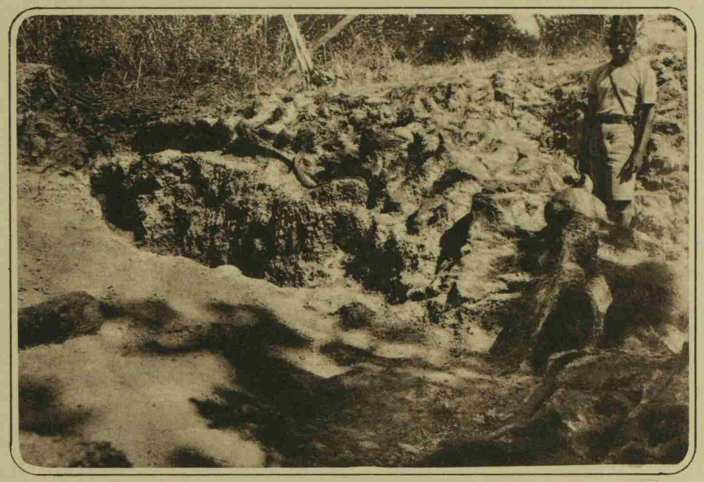
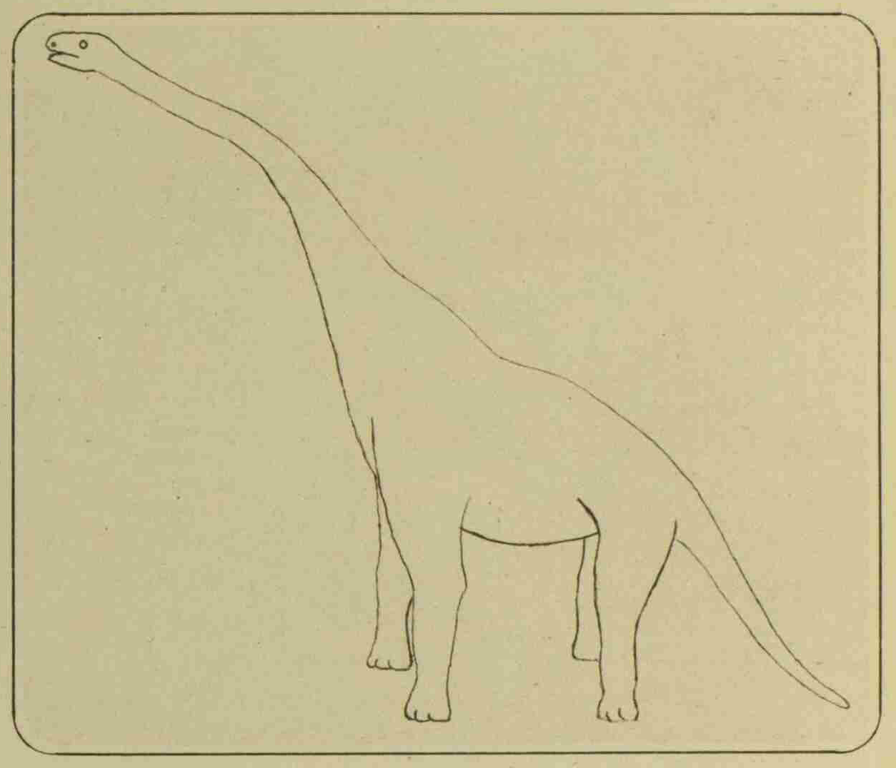
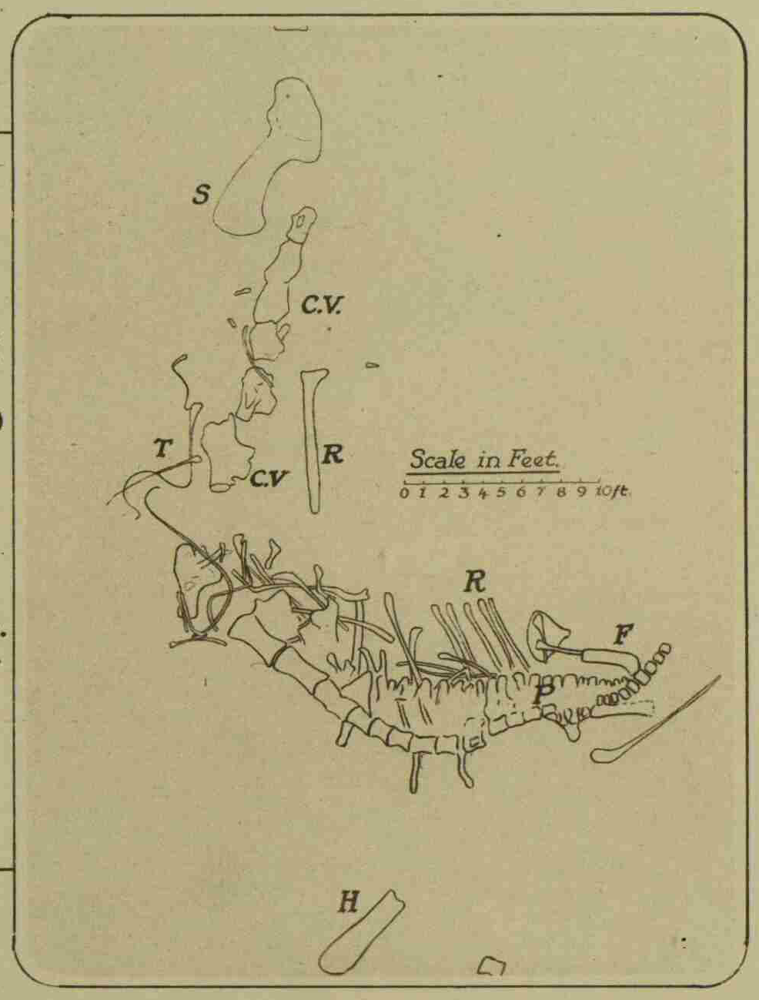
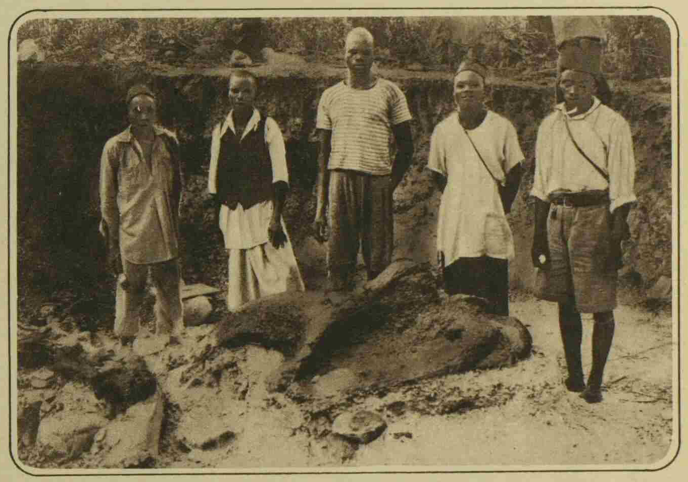
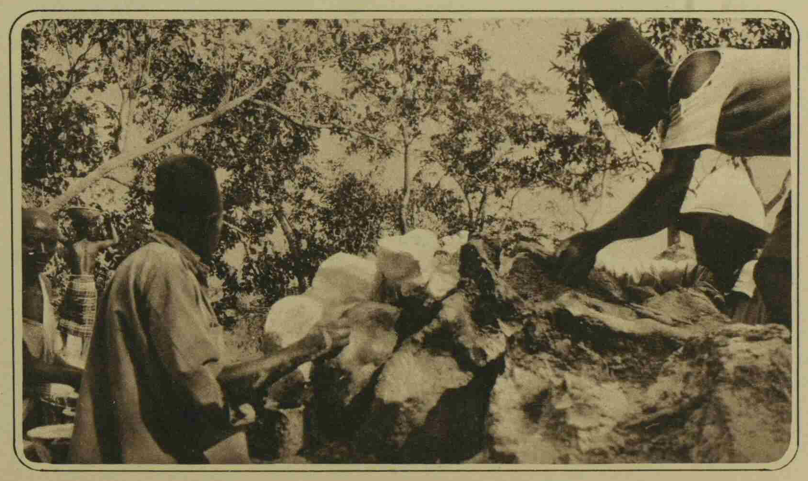
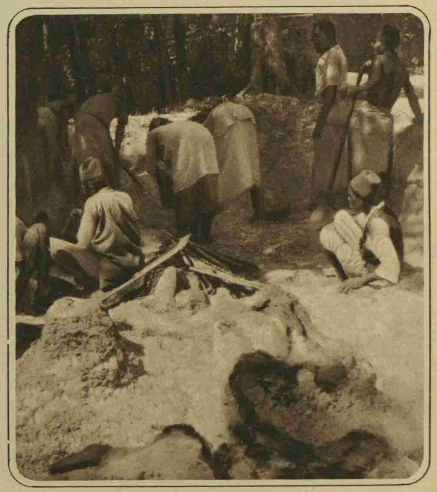

**Figure 1.** The dinosaur skeleton _in situ_: a view of the back, showing the huge ball-joint of a neck vertebra (right); the large neural plates of the shoulder vertebrae; and (left foreground) the lower end of a 7-ft. rib.

---

**Figure 2.** A restoration outline drawing of the Tendaguru dinosaur as it appeared in life: a huge giraffe-like creature about 20 ft. high at the shoulders, with a head some 30 ft. from the ground.

[NOTE: figure 2 is the earliest life restoration of the Archbishop.]

---

**Figure 3.** A plan (drawn to scale) of the huge dinosaur skeleton as it was found.
C.V. cervical (neck) vertebrae.
F. femur (thigh-bone).
H. humerus.
P. Pelvic region.
R. ribs.
S. shoulder-girdle.
T. ossified neck-tendons

---

**Figure 4.** The dinosaur's scapular (shoulder-blade) and coracoid bones, measuring over 8 ft. in length: the enormous shoulder-girdle which carried the main weight of the animal -- the enormous size of which is indicated by comparison with the men standing beside it.

---

**Figure 5.** Applying preservative treatment to the bones of the dinosaur: some of the neural plates of the dorsal vertebrae in process of being plastered before they were separated and packed for removal.

---

**Figure 6.** Native assistants at work on the neck region of the dinosaur at the scene of discovery: (in foreground) one of the largest cervical vertebrae, nearly 4 ft. long.

